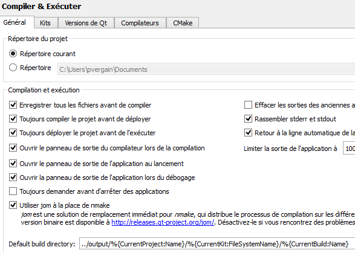


.. index::
   pair: Qt Creator; Output

.. _qtcreator_output:

===================
Qt Creator Output
===================

::

    - C:\projects_id3\XLOG2Q245_Easytest2_indus\0.8.1\output\test_all\Desktop_Qt_5_0_2_MinGW_32bit\Debug
    - ../output/%{CurrentProject:Name}/%{CurrentKit:FileSystemName}/%{CurrentBuild:Name}
      
