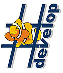



.. index::
   pair: Shardevelop ; C♯
   pair: IDE ; Shardevelop
   ! Shardevelop

.. _sharpdevelop:

===========
Shardevelop
===========

.. seealso::

   - http://www.icsharpcode.net/OpenSource/SD/Default.aspx
   - https://en.wikipedia.org/wiki/SharpDevelop
   - http://community.sharpdevelop.net/

   *Logo sharpdevelop*

SharpDevelop is a free and open source IDE for the programming languages C#,
Visual Basic .NET (VB.NET), Boo, F# (starting at version 3.0), IronPython, and
Clarion.

It is typically used as an **alternative to Microsoft's Visual Studio .NET**

Early in its development there was a fork to Mono/Gtk# called MonoDevelop which
includes cross-platform support.

.. toctree::
   :maxdepth: 4

   versions/index

