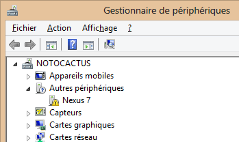
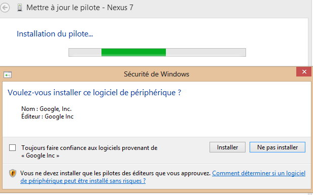
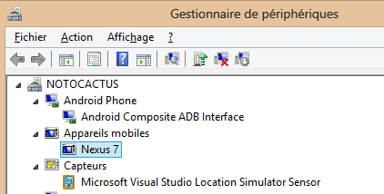



.. _windows8_adb_installation:

=================================================
Windows8 ADB (Android Debug Bridge) installation 
=================================================

.. contents::
   :depth: 3

Download the Assus driver for Nexus7
=====================================

.. seealso::

   - http://www.asus.com/Tablets_Mobile/Nexus_7/#support_Download_8

Install this ADB (Android Debug Bridge) driver to proceed with debugging 
on Nexus 7

Before driver update
=====================

   
  
Updating the driver
===================

   
  
After driver update
=====================

   
   

