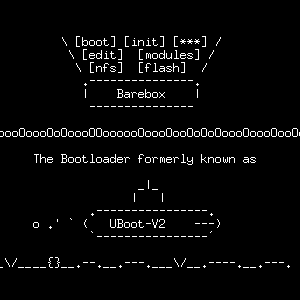


.. index::
   pair: bootloader; barebox

.. _barebox:

==========================
Barebox
==========================

.. seealso::

   - http://www.barebox.org
   - git://git.pengutronix.de/git/barebox.git

   *Barebox logo*

.. figure:: pengutronix.png

   *Pengutronix*

Barebox, a newer open-source bootloader, with a cleaner
design than U-Boot, but less hardware support for the
moment.

Barebox (formerly known as u-boot-v2) is a bootloader that inherits the best
of U-Boot and the Linux kernel: The size and look-and-feel of u-boot, with
driver model and lots of design concepts from the kernel.

Note also the slides_ from the ELCE09 talk by Sascha Hauer, creator of barebox.

.. _slides:  http://www.pengutronix.de/events/20091015-ELC-Europe/PRE-20091017-1-OSELAS.Training-U-Boot-V2.pdf

Documentation
=============

.. seealso:: http://wiki.barebox.org/doku.php

Barebox is a bootloader that initializes a hardware and boots Linux and maybe
other operating systems or bare metal code on a variety of processors.

It was initially derived from U-Boot and captures up with several of it's ideas,
so users being familiar with U-Boot should come into production quickly with barebox.

However, as the barebox developers are highly addicted to the Linux kernel, its
coding style and code quality, we try to stick as closely as possible to the
methodologies and techniques developed in Linux.

In addition we have a strong background in POSIX, so you'll find several good
old Unix traditions realized in Barebox as well.

