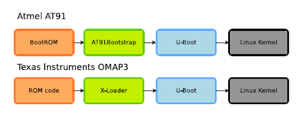


.. index::
   pair: bootloader; U-boot

.. _u_boot:

==========================
U-Boot
==========================

.. seealso::

   - http://www.denx.de/wiki/U-Boot

   *U-boot principle*

U-Boot is the de-facto standard in open-source bootloaders.

Available on ARM, PowerPC, MIPS, m68k, Microblaze, x86, NIOS, SuperH, Sparc.

Huge hardware support available, large number of features (networking, USB, SD,
etc.)

Wiki area
=========

.. seealso:: http://www.denx.de/wiki/U-Boot

Welcome to the Wiki area for cooperating on U-Boot development.

.. _uboot_coding_style:

Coding style
============

.. seealso:: http://www.denx.de/wiki/U-Boot/CodingStyle

The following Coding Style requirements shall be mandatory for all code
contributed to the U-Boot project.

Exceptions are only allowed if code from other projects is integrated with no
or only minimal changes.

Versions
========

.. toctree::
   :maxdepth: 4

   versions/index
