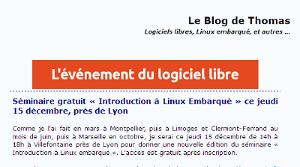

.. index::
   pair: embedded linux; 2011
   pair: Système embarqué; free-electrons    
   pair: Système embarqué; Thomas Petazzoni  

.. _intro_linux_embarque_2011:

======================================================================
Introduction à Linux embarqué (Villefontaine (38) le 15 décembre 2011
======================================================================

.. seealso::

   - http://free-electrons.com/fr/blog/seminaire-linux-embarque-15-dec-2011-lyon/
   - http://free-electrons.com/company/staff/thomas-petazzoni/
   - http://linuxfr.org/news/s%C3%A9minaire-gratuit-linux-embarqu%C3%A9-jeudi-15-d%C3%A9cembre-pr%C3%A8s-de-lyon
   - http://www.buildroot.org/
   - http://lwn.net/
   - :ref:`thomas_petazzoni`

.. contents::
   :depth: 2

Le programme au format pdf
==========================

.. seealso:: http://pvergain.files.wordpress.com/2012/01/presentation-printed.pdf

Adresse
=======

::

    Jeudi 15 décembre 14:00-18:00
    Villefontaine (38)

   *Annonce de la conférence à Villefontaine*

Depuis une dizaine d’années maintenant, le système d’exploitation Linux et les
logiciels open-source offrent de nouvelles possibilités pour le développement
des systèmes embarqués.

Avec un faible coût, un code source disponible et modifiable, des offres de
support commercial ou communautaire, des possibilités de réutilisation
importantes permettant de se focaliser sur la valeur ajoutée de son système
embarqué, la solution Linux embarquée a de nombreux atouts en comparaison de
systèmes propriétaires traditionnels ou de solutions spécifiques.

Ce séminaire se propose de faire le point sur les possibilités offertes par
l’utilisation de Linux dans l’embarqué, en couvrant les sujets énoncés dans le
programme ci-dessous.

PROGRAMME
=========

14h - Introduction
------------------

Bref historique de Linux et du monde open-source.

Les avantages de Linux et de l’open-source dans l’embarqué

Matériel nécessaire pour utiliser Linux embarqué
------------------------------------------------

Quelques exemples de plateformes répandues.

L’offre du monde open-source pour les systèmes embarqués
--------------------------------------------------------

- La chaîne de compilation Les chargeurs de démarrage
- Le noyau Linux et les pilotes de périphériques
- Les bases du système Les bibliothèques graphiques et multimédia
- Les composants orientés réseau
- Les extensions temps-réel

Le système Android, comparaison avec Linux embarqué

Le processus de développement d’un système Linux embarqué
----------------------------------------------------------

- Les licences open-source
- Construction du système Linux
- Développement et mise au point des applications

Le support commercial et le support communautaire.

Comment s’appuyer sur la communauté open-source pour accélérer le développement
de son système embarqué.

Conclusion – Débat – Questions/réponses
---------------------------------------

Des démonstrations illustrant l’utilisation pratique de Linux embarqué sur une
carte ARM seront réalisées au fil de la présentation.

