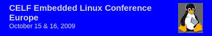



.. index::
   pair: Grenoble ; Embedded Linux Conference Europe (ELCE) 2099
   pair: Linux embedded; ELCE 2009

.. _videos_elce_2009:

=====================
Vidéos de l'ELCE 2009
=====================

.. seealso::

   - http://linuxfr.org/2010/03/24/26636.html
   - http://embeddedlinuxconference.com/elc_europe09/

   *Linux embedded video 2009 Grenoble*

Videos from the Embedded Linux Conference Europe, Grenoble, October 2009

Just a few weeks before the next edition of the Embedded Linux Conference
in San Francisco, here are the videos from the previous edition in Europe
a few months ago.

These videos were shot by Satoru Ueda and Tim Bird (Sony), Ruud Derwig (NXP)
and by Thomas Petazzoni and Michael Opdenacker (Free Electrons). As usual,
they are released under the terms of the Creative Commons Attribution –
ShareAlike Licence version 3.0.

Ruud DerwigIf you have never been to an Embedded Linux Conference yet, these
videos should show you how useful this conference is for embedded Linux system
developers. This is the place where you can discover new development tools and
technologies that will change your working life, benefit from the experience
from your peers, get the opportunity to talk to the fantastic people who
implement the Free and Open Source software that makes your system run,
and win cool penguin goodies. So, don’t miss next next edition in
San Francisco. It’s still time to register.

Les vidéos de l'édition 2009 de l'Embedded Linux Conference Europe (ELCE),
qui s'est tenue pour la première fois en France à Grenoble en octobre dernier,
sont enfin disponibles en licence libre sur le site de Free Electrons.

Si vous êtes intéressés par le thème des logiciels libres et de l'embarqué,
vous trouverez un large spectre de sujets couverts par des intervenants issus
du monde entier.

Cela peut également vous permettre de faire connaissance avec
des acteurs français dans ce domaine, venus en nombre cette année:

- Grégory  Clément (Adeneo),
- Florian Fainelli (OpenWRT),
- Philippe Gerum (Sourcetrek),
- Nicolas Palix (Université de Copenhague),
- Pascal Pellet (e2v),
- Cédric Hombourger (Montavista),
- Pierre Ficheux (OS4I),
- Jean-Pierre André (Tuxera),
- Yann E. Morin (Crosstool-ng),
- Jean-Marc Temmos (Visteon Software),
- Samuel Ortiz (Intel)
- Michael Opdenacker (Free Electrons).

Free Electrons sera également présent à l'édition nord-américaine de cette
conférence, qui aura lieu le mois prochain à San Francisco, et nous filmerons
également les interventions. N'hésitez pas à nous faire signe si vous aussi
avez la chance d'y participer !

- [en] Vidéos de l'ELCE 2009 <http://free-electrons.com/blog/elce-2009-videos/>
- [en] ELCE 2009 à Grenoble (136 clics)
- [en] ELC 2010 à San Francisco (68 clics)

