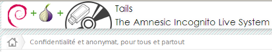


.. index::
   pair: GNU/Linux distributions ; Tails

.. _tails:

=========
Tails
=========

.. seealso::

   - http://tails.boum.org/about/index.fr.html

Tails est un système 'live' : un système d'exploitation complet destiné à être
utilisé sur un CD ou une clef USB indépendamment du système installé sur
l'ordinateur. C'est un logiciel libre basé sur Debian GNU/Linux.

Tails est livré avec de nombreuses applications, configurées avec une attention
particulière accordée à la sécurité : navigateur internet, client de messagerie
instantanée, client email, suite bureautique, éditeur d'image et de son, etc.

