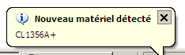
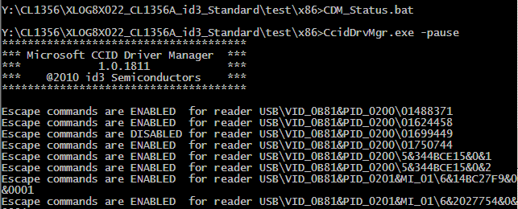
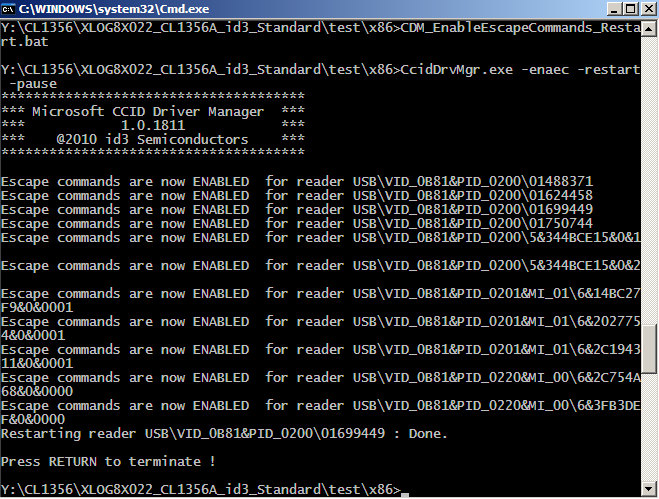

.. module:: Windows_ccid_driver_manager
    :synopsis: Windows CCID driver manager

.. index::
   pair: CCID ; DriverManager
   pair: CCID ; CCID Escape commands
   pair: CCID ;  proprietary commands (Escape commands)
   pair: CCID ; Escape commands

.. _ccid_driver_manager_id3_semiconductors:

=========================================
CCID driver manager  (id3 Semiconductors)
=========================================

.. seealso::

   - :ref:`windows_devcon_tool`
   - :ref:`windows_usbccid_driver`

.. contents::
   :depth: 3

This is a proprietary software from id3 Semiconductors.

Performs EscapeCommandEnable management, registry keys cleanup and smartcard
reader restart.

Usage
=====

::

    CcidDrvMgr.exe -help -pause

::

    **************************************
    *** Microsoft CCID Driver Manager  ***
    ***            1.0.1811            ***
    ***    @2010 id3 Semiconductors    ***
    **************************************

    <> Displays CCID Driver Escape Commands status <>
       Syntax : CcidDrvMgr -status

    <> Enables CCID Driver to pass Escape Commands to reader <>
       Syntax : CcidDrvMgr -enaec -pid=PID -reenum

       where params are :
       PID      : the USB Product ID to filter.
                  Optional : if omitted, Escape commands are enabled for all products IDs
       restart   : performs an USB re-enumeration of smartcard readers to force drive r to read new registry settings

    <> Disables CCID Driver to pass Escape Commands to reader <>
       Syntax : CcidDrvMgr -disec -pid=PID -reenum
       where params are :
       PID      : the USB Product ID to filter.
                  Optional : if omitted, Escape commands are disabled for all products IDs
       restart  : performs an USB re-enumeration of smartcard readers to force driver to read new registry settings

    <> Removes Readers <>
       Syntax : CcidDrvMgr -remove -pid=PID
       where params are :
       PID      : the USB Product ID for which operation is performed.
                  Optional : if omitted, all readers are removed
       restart  : performs an USB re-enumeration to force new devioce enumeration

    <> Others switches common to all modes <>
      -help       : displays this text
      -quiet      : no information are displayed. Ignored if present with -dispkeys switch
      -pause      : Keyboard key must be pressed before the manager can exit. Ignore if quiet mode

When you plug a smartcard reader you have to enable the propriatary command.

CDM_Status.bat
===============

::

    CcidDrvMgr.exe -pause

.. index::
   proprietary CCID commands

Enable the proprietary commands
===============================

To enable the :term:`CCID` proprietary commands:

::

    CcidDrvMgr.exe -disec -restart -pause

x64 CcidDrvMgr version
======================

:download:`x64 CcidDrvMgr.exe version <x64/CcidDrvMgr.exe>`

x86 CcidDrvMgr version
======================

:download:`x86 CcidDrvMgr.exe version <x86/CcidDrvMgr.exe>`

