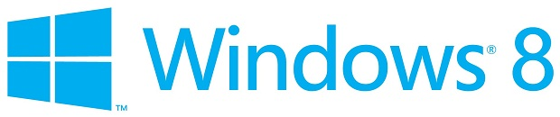


.. index::
   pair: Windows OS; windows 8

.. _windows_8:

=========================
Windows 8
=========================

.. seealso::

   - https://fr.wikipedia.org/wiki/Windows_8
   - http://blogs.msdn.com/b/b8/

   *Le logo de windows 8*

.. contents::
   :depth: 3

Introduction
============

Windows 8 est l’actuel nom de code donné par Microsoft au successeur du système
d’exploitation Windows 7, et devrait sortir en octobre 2012.

La version pré-bêta (Developer Preview)3 publique a vu le jour en
septembre 2011, une version bêta publique devrait aussi voir le jour mi/fin
février 2012, la version RC devrait sortir elle en avril 20121, et la version
RTM en juillet 2012.

Pour Microsoft, Windows 8 est devenu une priorité en juillet 2010.

Polémiques
==========

Cette nouvelle version de Windows pourrait imposer l'utilisation d'un BIOS de
confiance, appelé EFI, qui est plus sécurisé, mais rend quasi impossible
l'installation d'autres système d'exploitation à coté de Windows 8.

Microsoft a signalé que cette option sera facilement désactivable, mais cela
dépend des OEM.

En outre Microsoft impose aux OEM que les machines ARM soient bloquées sur les
systèmes d'exploitation de Microsoft pour pouvoir faire tourner Windows 8.

Interface
=========

Une nouvelle interface sera mise d'avant par les développeurs de Microsoft.

Il s'agit de l'interface Metro annoncée lors de la conférence BUILD de
septembre 2011. Elle assurera la continuité de Windows Explorer en incorporant
le style ruban inauguré à partir d'Office 2007.

Le Menu Démarrer a été changé complètement en Start Screen, ou écran de
démarrage, similaire à celui de Windows Phone 7.

News
====

.. toctree::
   :maxdepth: 3

   news/index

Versions
========

.. toctree::
   :maxdepth: 3

   windows8_Pro/index
   windows8_RT/index
   Windows8_standard/index

