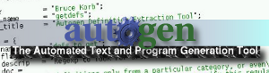



.. index::
   pair: Autotools; Autogen
   ! Autogen

.. _autogen:

==========
Autogen
==========

.. seealso::

   - http://fr.wikipedia.org/wiki/GNU_AutoGen
   - http://git.savannah.gnu.org/cgit/autogen.git/tree/README
   - http://www.gnu.org/software/autogen/manual/html_node/autogen.html
   - http://savannah.gnu.org/projects/autogen

.. contents::
   :depth: 3

Introduction
============

GNU AutoGen est un logiciel utilitaire utilisé pour simplifier la phase 
répétitive de création ou de maintenance de logiciels traitant une 
quantité importante de texte. 

Cet outil maintenu par le projet GNU est particulièrement adapté pour 
les programmes exigeant la synchronisation de plusieurs blocs de texte.

Il intervient dans le mécanisme des autotools pour la génération dans 
GCC des fichiers Makefile.am. 

Il devient par là même un composant de la compilation et peut 
virtuellement intervenir dans la génération des fichiers Makefile.in 
dans une approche similaire à yacc et lex (en).

AutoGen est à l'origine développé dans les années 1990 par Bruce Korb 
et Gary V. Vaughan puis maintenu pour le projet GNU par l'un de ses 
auteurs depuis 2004.

GNU AutoOpts est distribué avec le projet AutoGen.

Autogen source code
===================

.. seealso:: 

   - http://savannah.gnu.org/git/?group=autogen

::

    git clone git://git.savannah.gnu.org/autogen.git

