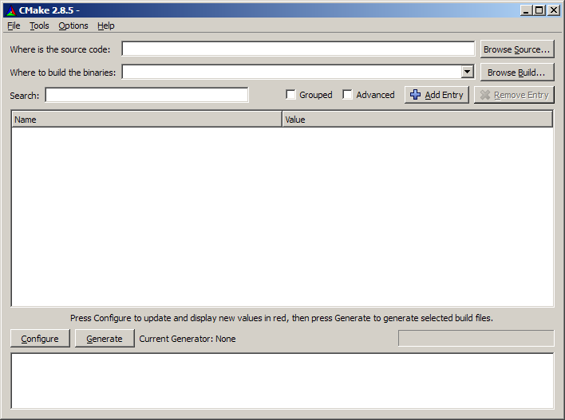



.. index::
   pair: Building tool ; Cmake
   ! Cmake

.. _cmake_building_tool:

=====
Cmake
=====

.. image:: cmake75.png

.. seealso::

   - http://fr.wikipedia.org/wiki/Cmake

.. contents::
   :depth: 3

Définition
==========

``CMake`` est un « moteur de production » multiplate-forme. Il est comparable au
programme Make dans le sens où le processus de construction logicielle est
entièrement contrôlé par des fichiers de configuration, appelés CMakeLists.txt
dans le cas de CMake.

Mais CMake ne produit pas directement le logiciel final, il s'occupe de la
génération de fichiers de construction standards : makefiles sous Unix, et
fichiers de projet Visual Studio sous Windows. Cela permet aux développeurs
d'utiliser leur environnement de développement préféré comme à leur habitude.

C'est cette utilisation des outils habituels de développement qui distingue
CMake des autres systèmes de production comme SCons ou les Autotools.

Le nom "CMake" est l'abréviation de "cross platform make". Malgré l'utilisation
de "make" dans son nom, CMake est une application séparée et de plus haut niveau
que l'outil make.

Cmake GUI
=========

.. index::
   Cmake and Qt

http://www.shadoware.org/post/%5BQt%5D-CMake-et-Qt
==================================================

Suite à un billet datant de 2008, je reviens vers vous pour ajouter quelques
précisions sur la compilation de programme Qt avec CMake. En effet, pour mon
programme XINX, j'ai modifié la chaîne de compilation actuelle utilisant QMake
par une chaîne de compilation CMake.

CMake est un puissant générateur de Makefile, il permet de remplacer les anciens
(mais pas complètement révolus) ``autotools``.

**CMake ne remplace donc pas le programme make mais vient se placer en amont**.

CMake permet de compiler un programme à différents endroits du dossier des
sources, ce qui permet de garder le répertoire des sources propre.

.. index::
   pair: Cmake ; brlcad, libnfc, opencv

Projects using Cmake
====================

.. toctree::
   :maxdepth: 3
   
   projects_using_cmake/index
   
   
