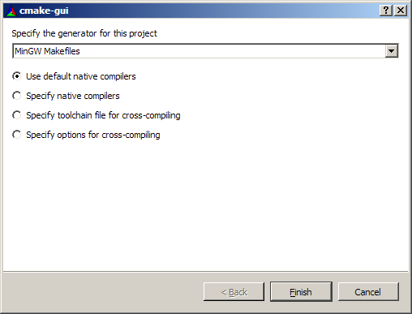
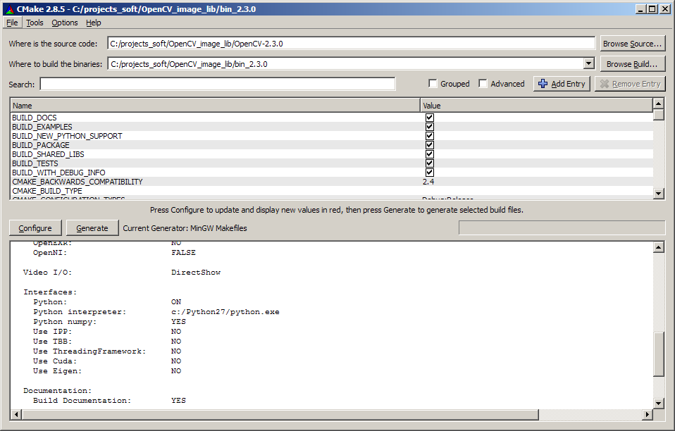


.. index::
   pair: CMake; OpenCV

.. _opencv_cmake:

=================
Opencv 
=================

.. seealso::

   - http://opencv.willowgarage.com/wiki/InstallGuide
   - :ref:`opencv_image_library`

.. contents::
   :depth: 3

Description
===========

Do the cmake step from inside the folder where you want to build OpenCV.
It is a good practice to keep your source and build files (the files that are
going to be generated after the cmake step) separately.

Remember to specify the source folder while invoking cmake as the last argument.
Otherwise cmake will scan for CMakeLists.txt file in the usual standard location
/usr/local/src and will throw an error.

Unzipping all OpenCV directories from the source files to the src folder is not
an elegant way of doing things in linux.

If you have a gui version of cmake installed, just do this from inside the build
folder, $ ccmake <OpenCV source folder>

Another example for Windows users (assuming the .exe extracted files to C:\OpenCV2.3\)

   
   

