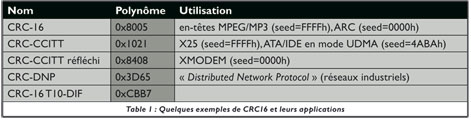

.. index::
   pair: Communication ; CRC
   ! CRC

.. _crc_com:

==============================
CRC (Cyclic Redundancy Check)
==============================

.. seealso::

   - http://fr.wikipedia.org/wiki/Contr%C3%B4le_de_redondance_cyclique
   - http://en.wikipedia.org/wiki/Cyclic_redundancy_check
   - http://www.tty1.net/pycrc/
   - :ref:`crc_crypto`

.. contents::
   :depth: 3

Introduction
============

En informatique et dans certains appareils numériques, un contrôle de redondance
cyclique ou CRC (Cyclic Redundancy Check) est un outil logiciel permettant de
détecter les erreurs de transmission ou de transfert par ajout, combinaison et
comparaison de données redondantes, obtenues grâce à une procédure de hachage.

Ainsi, une erreur de redondance cyclique peut survenir lors de la copie d'un
support (disque dur, CD-Rom, DVD-Rom, clé USB, etc.) vers un autre support de
sauvegarde.

Sciences/Théorie de l’information : propriétés et dérivés des CRC et LFSR
=========================================================================

.. seealso::

   - http://www.unixgarden.com/index.php/gnu-linux-magazine/sciencestheorie-de-l-information-proprietes-et-derives-des-crc-et-lfsr
   -

Les algorithmes de CRC (Cyclic Redundancy Codes ou Codes Redondants Cycliques
en français) permettent de signer des blocs de données afin d’y détecter
ultérieurement d’éventuelles altérations.

C’est un peu comme une empreinte MD5 ou SHA, mais sans toutes les contraintes
cryptographiques, remplacées par des exigences de vitesse et de compacité.

Statistiquement, la probabilité qu’une ou des erreurs ne changent pas la
signature (un faux positif) est inversement proportionnelle à l’exponentielle
de la taille de la signature (en 2^-n), donc une signature longue est préférable.

Bien que le CRC 32 bits soit actuellement le plus utilisé (notablement par les
trames Ethernet ou dans la Zlib, avec le polynôme 0x04C11DB7 déjà utilisé dans
d’autres articles), la version 16 bits que nous étudions a de nombreuses
applications (voir la table 1), en particulier quand les blocs à signer sont
courts.

D’autres facteurs sont en faveur d’une signature sur 16 bits (au lieu de 32 bits):
les erreurs de transmission ou de stockage sont rares en pratique, les
conséquences ne sont pas critiques et le surcoût d’une signature longue peut
contrebalancer les gains de compression.

Un algorithme de CRC est défini par plusieurs paramètres:

- sa taille (le nombre  de bits de la signature),
- son polynôme (c’est la manière dont les bits sont mélangés entre eux),
- sa valeur initiale (ou seed)
- ainsi que d’autres détails optionnels qui ne nous concernent plus ici (ils ont
  été traités en décembre et nous n’en aurons plus besoin avec nos nouveaux algorithmes).

Pour schématiser grossièrement, un algorithme de CRC calcule une division un peu spéciale :

- le nombre à diviser est le flux de données à signer ;
- le diviseur est le fameux polynôme ;
- le reste est le résultat désiré (le " CRC ") ;
- le dividende est ignoré.

Ensuite, la division utilise une arithmétique spéciale, appelée GF(2) par les
intimes, où l’addition et la soustraction que nous connaissons sont réalisées
simplement par un XOR. Il en découle que la multiplication et la division dans
GF(2) sont une succession de décalages et de XOR, très faciles à réaliser en
matériel comme en logiciel.

Autre détail important, le diviseur a des propriétés mathématiques spéciales et
il est représenté soit sous forme d’un polynôme, soit sous forme condensée
numérique. Il n’est pas pris au hasard, car il doit répondre à certaines conditions,
en particulier être primitif (notion que j’ai tenté d’expliquer dans l’article
précédent de mars 2006), ce dont nous allons bientôt reparler.

CRC generator
=============

.. seealso::

   - http://www.tty1.net/pycrc/

