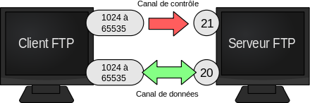


.. index::
   pair: FTP ; Servers

.. _ftp_servers:

============================================================
FTP Servers
============================================================

.. seealso::

   - http://fr.wikipedia.org/wiki/Serveur_FTP
   
   

   
   
Description
===========

Le serveur FTP (File Transfer Protocol) permet, comme son nom l'indique, de 
transférer des fichiers par Internet ou par le biais d'un réseau informatique 
local (intranet).

Toute personne en ayant l'autorisation, peut télécharger et envoyer des fichiers 
sur un ordinateur distant faisant fonctionner un tel serveur. 

Le port par défaut et le plus souvent utilisé est le port 21.

Servers
=======

.. toctree::
   :maxdepth: 3
   
   vsftpd/index
   
   

      
