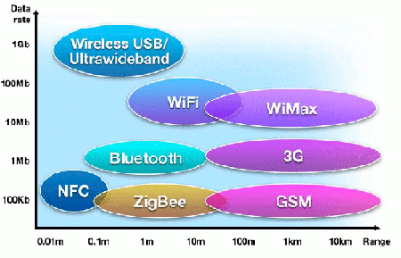


.. index::
   ! NFC
   ! Near field communication

.. _NFC:

==============================
NFC (Near field communication)
==============================

   

.. contents::
   :depth: 3   

NFC definition
==============

Near field communication, or NFC, allow for simplified transactions, data
exchange, and connections with a touch.[1] Formed in 2004, the Near Field
Communication Forum (NFC Forum) promotes sharing, pairing, and transactions
between NFC devices[2] and develops and certifies device compliance with NFC
standards.[3]

A smartphone or tablet with an NFC chip could make a credit card payment or
serve as keycard or ID card. NFC devices can read NFC tags on a museum or
retail display to get more information or an audio or video presentation.

NFC can share a contact, photo, song, application, or video or pair Bluetooth
devices

Communication en champ proche
=============================

.. seealso:: http://fr.wikipedia.org/wiki/Communication_en_champ_proche

La communication en champ proche (Near Field Communication), habituellement
appelée NFC , est une technologie de communication sans-fil à courte portée et
haute fréquence, permettant l'échange d'informations entre des périphériques
jusqu'à une distance d'environ 10 cm.

Cette technologie est une extension de la norme ISO/CEI 14443 standardisant les
cartes de proximité utilisant la RFID (Radio Frequency IDentification), qui
combinent l'interface d'une carte à puce et un lecteur au sein d'un seul
périphérique.

Un périphérique NFC est capable de communiquer autant avec le matériel ISO/CEI
14443 existant qu'avec un autre périphérique NFC, et est tout autant compatible
avec les infrastructures sans-contact existantes déjà en utilisation dans les
transports en commun et les terminaux de paiement.

La NFC est à la base conçue pour un usage dans les téléphones mobiles.

Cas d'utilisation
==================

.. toctree::
   :maxdepth: 3

   os/index
   nfc_tools/index
   use_cases/index
