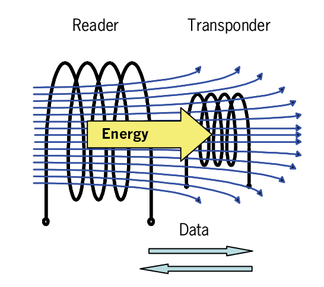


.. index::
   ! RFID

.. _RFID:

=====
RFID
=====

.. seealso::

   - https://secure.wikimedia.org/wikipedia/fr/wiki/RFID
   - http://www.centrenational-rfid.com/
   - http://www.openpcd.org/Live

.. contents::
   :depth: 3

What does RFID mean ?
=====================

RFID is a special kind of wireless communication to identify or count an object
contactless.

On one side you have a RFID-reader, like a terminal or handheld device.
On the other side you have a transponder, like a tag or a label.

Passive RFID system
-------------------

In a passive RFID system, the reader sends out a field of energy and data.
The transponder uses the energy and data to read out his memory and sends the
content back to the reader.

Active RFID system
------------------

At an Active-RFID system the transponder has its own battery, which allows much
bigger memory sizes, a wider range and a faster communication.

Parameters table
-----------------

+-------------------------+-----------------------------+----------------------------+--------------------------+----------------------------+
| Parameter               | Low frequency               | High frequency             | Ultra High               | frequency Microwave        |
+=========================+=============================+============================+==========================+============================+
| Frequency               | 125 kHz                     | 13.56 MHz                  | 868 MHz                  | 2.4 GHz                    |
+-------------------------+-----------------------------+----------------------------+--------------------------+----------------------------+
| Reading distance (max.) | 1 m                         | 1.5 m                      | 10 m                     | 80 m (active)              |
+-------------------------+-----------------------------+----------------------------+--------------------------+----------------------------+
| Reading rate            | slow                        | Depending on ISO-Standards | fast very                | fast (active transponder)  |
+-------------------------+-----------------------------+----------------------------+--------------------------+----------------------------+
| Humidity                | No influence                | No influence               | Negative influence       | Negative influence         |
+-------------------------+-----------------------------+----------------------------+--------------------------+----------------------------+
| Metal                   | Negative influence          | Negative influence         | No influence             | No influence               |
+-------------------------+-----------------------------+----------------------------+--------------------------+----------------------------+
| ISO standards           | - 11784/85                  | - 14443                    | - 14443,                 | 18000-4                    |
|                         | - 14223                     | - 15693                    | - 15693                  |                            |
|                         | - 18000-2                   | - 18000-3                  | - 18000-6                |                            |
+-------------------------+-----------------------------+----------------------------+--------------------------+----------------------------+
| Applications            | - Admission control,        | - scrubber agreement       | - Pallet collection      | container tracking         |
|                         | - going away barrier        | - asset management         | - container tracking     |                            |
|                         | - scrubber agreement        | - ticketing                |                          |                            |
|                         | - gas reading               | - tracking and tracing     |                          |                            |
|                         |                             | - group collection         |                          |                            |
+-------------------------+-----------------------------+----------------------------+--------------------------+----------------------------+

RFID tools
===========

.. toctree::
   :maxdepth: 4

   RFID_tools

