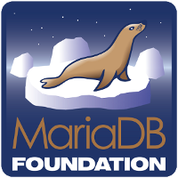

.. index::
   pair: SQL; MariaDB
   pair: Chocolatey; MariaDB
   ! MariaDB

.. _mariadb:

==========
MariaDB
==========

.. seealso::

   - http://fr.wikipedia.org/wiki/MariaDB
   - https://github.com/MariaDB/server
   - https://mariadb.org/

.. contents::
   :depth: 3

Introduction
============

``MariaDB`` est un système de gestion de base de données édité sous licence 
GPL. 

La société mère derrière MariaDB est Monty Program AB. 

Ce SGBD offre la garantie de rester Opensource.

Historique
===========

Suite au rachat de MySQL par Sun Microsystems et des annonces du rachat 
de Sun Microsystems par Oracle Corporation, Michael Widenius, fondateur 
de MySQL, quitte cette société pour lancer Maria DB, version concurrente 
(fork) et 100 % compatible avec MySQL.

Les différentes versions de MariaDB s'articulent sur le code source de 
MySQL de la version 5.1 aux versions plus récentes (comme la 5.6 fin 2012).

En parallèle, un consortium a été créé et sera chargé du développement 
de MariaDB : l'Open Database Alliance.

Depuis décembre 2012, Wikipédia utilise MariaDB.

En avril 2013 Mariadb (Monty Program AB) signe et annonce un accord de 
fusion avec la société SkySQL, l'objectif est de développer MariaDB dans 
une base de données open source «NewSQL», regroupant le meilleur de 
SQL et de NoSQL.

Source code
===========

.. seealso::

   - https://github.com/MariaDB/server

``MariaDB server`` is a community developed fork of MySQL server. 

Started by core members of the original MySQL team, MariaDB actively works with 
outside developers to deliver the most featureful, stable, and sanely licensed 
open SQL server in the industry.

Installation 
=============

.. seealso::

   - http://chocolatey.org/packages/mariadb/

To install MariaDB, run the following command from the command line or 
from PowerShell::

    C:\> cinst mariadb
    
    

