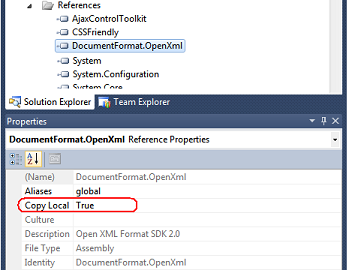

.. index::
   pair: Excel; OpenXML

.. _openXML:

========================
OpenXML
========================

.. seealso::

   - http://officeopenxml.sourceforge.net/
   - http://msdn.microsoft.com/en-us/library/office/bb448854.aspx
   - http://www.codeproject.com/Articles/692121/Csharp-Export-data-to-Excel-using-OpenXML-librarie

Introduction
============

It's amazing that even now, in 2013, there are so many developers still asking 
for help on how to write C# and VB.Net code, to export their data to Excel.

Even worse, a lot of them will stumble on articles suggesting that they should 
write their data to a comma-separated file, but to give the file an .xls extension.

So, today, I'm going to walkthrough how to use my C# "Export to Excel" class, 
which you can add to your C# WinForms / WPF / ASP.Net application, using one 
line of code. Simply tell the class where your DataSet, DataTable, or List<> data 
is stored, and what (Excel) filename you want to write to.

::

    // Step 1: Create a DataSet, and put some sample data in it
    DataSet ds = CreateSampleData();
    // Step 2: Create the Excel .xlsx file
    try
    {
        string excelFilename = "C:\\Sample.xlsx";
        CreateExcelFile.CreateExcelDocument(ds, excelFilename);
    }
    catch (Exception ex)
    { 
        MessageBox.Show("Couldn't create Excel file.\r\nException: " + ex.Message);
        return;
    }

However, to use this library, you'll need to add two files from the free 
Microsoft OpenXML SDK:

- ``DocumentFormat.OpenXml.dll`` From the free Microsoft Open XML SDK library
- ``WindowsBase.dll`` From the Microsoft .NET Framework library 

Add these two .dlls to your project's References section, and remember to set 
them to **Copy Local**.

   
   
Then, just download the CreateExcelFile.cs file, and add it to your application.

And that's it.

Regardless of if your data is stored in a List<>, DataTable or DataSet, you can 
export it to a "real" Office 2007 Excel .xlsx file using that one line of code.

And because it is created using the OpenXML library, you can run this code on 
machines which don't have Excel installed. 

   

