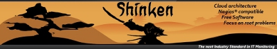

.. index::
   ! Shinken

.. _shinken:

=======
Shinken
=======

.. seealso::

   - http://www.shinken-monitoring.org/wiki/
   - http://shinken.ideascale.com/

.. contents::
   :depth: 3

Introduction
============

Shinken is a new monitoring tool in AGPLv3 written in Python and compatible
with Nagios. The main goal of Shinken is to allow users to have a fully
flexible architecture for their monitoring system that can easily scale to
large environments. It’s as simple as in all marketing “cloud computing”
slides, but here it’s real!

Shinken is compatible with the Nagios configuration standard and plugins.
It works on any operating system and architecture that supports Python,
which includes Windows and GNU/Linux.

Source
=======

- git clone git://shinken.git.sourceforge.net/gitroot/shinken/shinken

Articles
=========

.. seealso::

   - http://www.unixgarden.com/index.php/gnu-linux-magazine-hs/shinken-quand-un-python-rencontre-nagios-2

Shinken Version 1.2
====================

.. seealso:: http://blog.nicolargo.com/2012/09/interview-de-jean-gabes-pour-la-sortie-de-shinken-1-2.html

