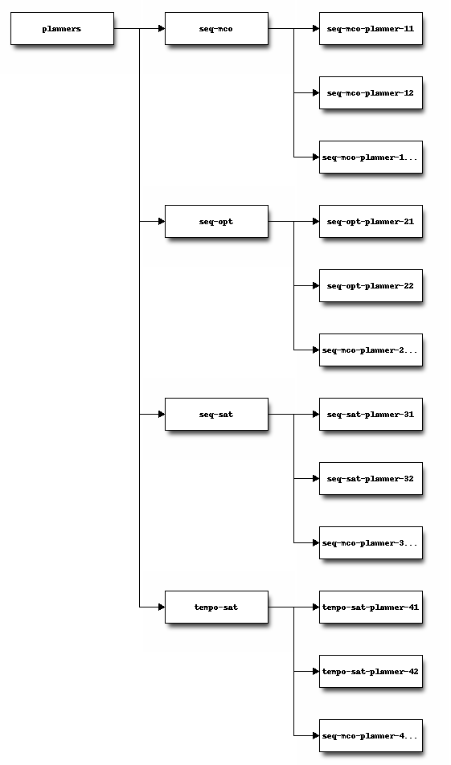

.. index::
   pair: Sphinx ; blockdiag extension
   pair: Block ; Diagram
   ! Blockdiag

.. _blockdiag_sphinx_extension:

============================================
Blockdiag (simple diagram images generator) 
============================================

.. seealso::

   - http://blockdiag.com/
   - http://interactive.blockdiag.com/
   - http://www.slideshare.net/TakeshiKomiya/blockdiag-a-simple-diagram-generator
   - http://blockdiag.com/en/blockdiag/sphinxcontrib.html
   - https://pypi.python.org/pypi/sphinxcontrib-blockdiag
   - https://bitbucket.org/birkenfeld/sphinx-contrib/src/e60f176286fe/blockdiag/setup.py
   - http://mentors.debian.net/package/sphinxcontrib-blockdiag
   - https://twitter.com/#!/tk0miya
   - :ref:`blockdiag_sphinx_extension_ref`

.. contents::
   :depth: 3

Introduction
============

Once again thanks a lot for your prompt replies. In case you are curious or
you ever have to face the same problem than I, I finally chose blockdiag.

With only a few statements::

    .. blockdiag::

       {
          planners -> seq-mco -> seq-mco-planner-11;
          planners -> seq-mco -> seq-mco-planner-12;
          planners -> seq-mco -> "seq-mco-planner-1...";
          planners -> seq-opt -> seq-opt-planner-21;
          planners -> seq-opt -> seq-opt-planner-22;
          planners -> seq-opt -> "seq-mco-planner-2...";
          planners -> seq-sat -> seq-sat-planner-31;
          planners -> seq-sat -> seq-sat-planner-32;
          planners -> seq-sat -> "seq-mco-planner-3...";
          planners -> tempo-sat -> tempo-sat-planner-41;
          planners -> tempo-sat -> tempo-sat-planner-42;
          planners -> tempo-sat -> "seq-mco-planner-4...";
       }

I could generate the attached figure and embed it in the html and pdf docs
generated with sphinx.

Just awesome!!

.. index::
   pair: Tarek Ziadé; Pycon

blockdiag pycon-japan-retrospective
===================================

.. seealso:: https://tarekziade.wordpress.com/2011/09/05/pycon-japan-retrospective/

Komiya Takeshi showed me his tool called blockdiag, which is a DSL you can use
to add diagrams in your documentation. The nice thing is that it provides a
Sphinx extension so you can add diagrams in your documentation through simple
expressions, and have Sphinx generate for you the diagrams on the fly.

There’s even an interactive online shell: http://interactive.blockdiag.com/

I’ve challenged Komiya to write a few diagrams I have for some Mozilla projects
using his tool, and it took a few seconds for him to build them. So, I am going
to use this in the future.

