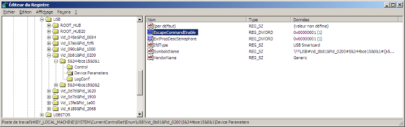

.. module:: AnnexesProprietary
    :synopsis: Proprietary commands

.. index::
   pair: PC/SC; EscapeCommandEnable

====================
Proprietary commands
====================

.. _escape_command_enable:

EscapeCommandEnable
===================

Les commandes propriétaires doivent être activées dans la base de registres
pour pouvoir être utilisées par le pilote usbccid de Microsoft (MS).

In order to send or receive an Escape command to a reader, the DWORD registry
value EscapeCommandEnable must be added and set to a non-zero value under the
HKLM\\SYSTEM\\CurrentControlSet\\Enum\\USB\\Vid*Pid*\\*\\Device Properties key.

.. seealso::

   - http://www.microsoft.com/whdc/device/input/smartcard/USB_CCID.mspx
   - :ref:`usbids`

