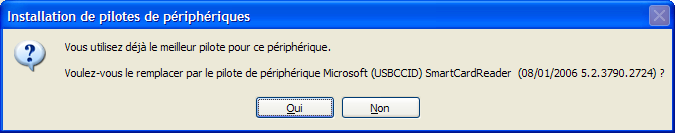
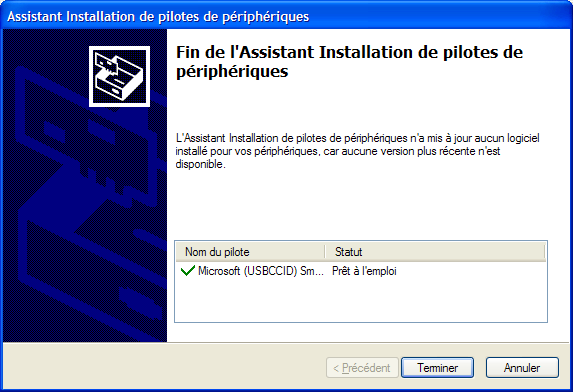

.. module:: dpinst
    :synopsis: dpinst doc
    :platform: windows XP, Vista, windows 7

    
.. index::
   dpinst
   
 
.. _dpinst:

==========
Dpinst.exe
==========

source:

* http://msdn.microsoft.com/en-us/library/ms790806.aspx

.. _dpinst_cli_switches:

DPInst Command-Line Switches
============================

DPInst supports the following command-line switches that set the DPInst 
configuration flags that are described in Setting DPInst Configuration 
Flags and additional switches that further modify DPInst operation:

/a
    Sets the installAllOrNone flag to ON, which configures DPInst to install 
    drivers in a driver package only if all of the drivers in the installation 
    package can be installed. 
    
/c
    Configures DPInst, if DPInst is called at a command prompt, to display 
    the text of log messages in the Command Prompt window. 
    
/d
    Sets the deleteBinaries flag to ON, which configures DPInst to delete 
    the binary files that were copied to a system when a driver package was 
    installed.

    .. note::  Starting with Windows 7, the /d switch is ignored by the operating 
       system. Binary files, which were copied to a system when a driver package 
       was installed, can no longer be deleted by using DPInst.

/el
    Sets the enableNotListedLanguages flag to ON, which configures DPInst to 
    enable all of the supported languages that are not explicitly enabled by 
    language XML elements in a DPInst descriptor file. 
    
/f
    Sets the **forceIfDriverIsNotBetter flag to ON**, which configures DPInst 
    to install a driver on a device even if the driver that is currently 
    installed on the device is a better match than the new driver. 
    
/h, /?, or /help
    Configures DPInst to display help information about DPInst command-line 
    options. If DPInst was called at a command prompt, DPInst displays the 
    help text in the Command Prompt window; otherwise, DPInst displays the 
    help text in a message box.
    
/l language-ID
    Configures DPInst to display the text, bitmaps, and icon for the language 
    that is specified by a language-ID value. The language-ID value can be 
    specified in either hexadecimal or decimal format. For a list of the 
    languages and corresponding language identifiers, see DPInst 
    Localization Support.

    If DPInst supports the specified language and runs on a Windows operating 
    system in which the language is installed, DPInst will use the specified 
    language. For more information about how to use the /L switch, 
    see Testing Language Customization.
    
/lm
    Sets the legacyMode flag to ON. In legacy mode, DPInst accepts unsigned 
    driver packages without performing signature verification. However, be 
    aware that Windows driver signing requirements apply to the installation 
    of a driver package from the DIFx driver store. These requirements depend 
    on the Windows version, the signature type, the driver package type, and 
    the driver signing options that are set for a computer.
    
/q or /s
    **Sets the quietInstall flag to ON, which suppresses the display of wizard 
    pages, user dialog boxes, and other user messages that DPInst and Windows 
    generate**. The quietInstall flag works with the presence of an end-user 
    license agreement (EULA) page and the suppressEulaPage flag. 
    
/p
    Sets the promptIfDriverIsNotBetter flag to ON, which configures DPInst 
    to display a user dialog box if a new driver is not a better match to a 
    device than a driver that is currently installed on the device. 
    The user dialog box informs a user of this situation and provides 
    an option to replace the driver that is currently installed on the 
    device with the new driver. see /sh flag
    
/path **DPInst-working-directory**
    Sets the DPInst working directory to DPInst-working-directory. 
    DPInst searches for driver packages in the DPInst working directory 
    and in subdirectories under the working directory that are specified 
    by subDirectory XML elements in a DPInst descriptor file. For more 
    information about how to set the DPInst working directory and specifying 
    subdirectories under the working directory, see Specifying the Location 
    of a Driver Package.
    
/sa
    Sets the suppressAddRemovePrograms flag to ON, which configures DPInst 
    to suppress the addition of entries to Programs and Features in Control 
    Panel. These entries represent the driver packages and driver package 
    groups that DPInst installs.

    .. note::  In versions of Windows earlier than Windows Vista, DPInst added  
       the entry for the driver package or driver package group to Add or Remove 
       Programs in Control Panel.
    
/se
    Sets the suppressEulaPage flag to ON, which configures DPinst to suppress 
    the display of a EULA page. The suppressEulaPage flag works with the quiet
    Install flag and the suppress Wizard flag.
    
/sh
    Sets the scanHardware flag to ON, which configures DPInst to install a 
    driver package for a Plug and Play (PnP) function driver only if the 
    driver package matches a device that is currently configured in a computer 
    and if the driver package is a better match for the device than the driver 
    package that is currently installed on the device. 
    
/sw
    Sets the suppressWizard flag to ON, which suppresses the display of wizard 
    pages and other user messages that DPInst generates. The suppressWizard flag 
    works with the presence of a EULA page and the suppressEulaPage flag.
    
/u inf-file-path
    Configures DPInst to uninstall a driver package whose INF file is specified 
    by inf-file-path. The path that is specified by inf-file-path is relative to 
    the directory that contains DPInst.exe.

    
.. index::
   dpinst calling examples
   
   
.. _dpinst_calling_examples:

DPInst calling examples
=======================

The following command includes the /q and /se command-line switches, which configure 
DPInst to operate in quiet-install mode, whether a eula XML element is included in 
a DPInst descriptor file. This command suppresses all of the wizard pages, user 
dialog boxes, and other user messages that DPInst and Windows generate.

:: 

    dpinst.exe /q /se

    
The following command includes the /q command-line switch, which configure DPInst to 
operate in quiet-install mode. However, DPInst will operate in quiet-install mode 
only if a eula XML element is not included in a DPInst descriptor file. 
If a eula element is included, DPInst does not operate in quiet-install mode.

:: 

    dpinst.exe /q

The following command includes a /se command-line switch, which suppresses 
the display of only the EULA page.

:: 

    dpinst.exe /se
    

The following command includes the /q and /se command-line switches, which 
configure DPInst to operate in quiet-install mode, including suppressing the EULA page. 
The command also includes the /f command-line switch, which forces the installation 
of a new driver package for a device that is configured in a computer, even if the 
driver package that is currently installed on the device is a better match for 
the device than the new driver package.

:: 

    dpinst.exe /q /se /f

The following command includes the **/sh** command-line switch, which configures 
DPInst to install a driver package on a device that is configured in a computer 
**only if the new driver package is a better match for the device than the driver 
package that is currently installed on the device**. This command facilitates using 
an installation package to batch install driver packages for devices that are 
configured in a computer. Although the installation package might contain a 
large number of driver packages, DPInst will install only driver packages that 
are better matches for the devices than the driver packages that are 
currently installed on the devices.

:: 

    dpinst.exe /sh

The following command includes the /u command-line switch, followed by the 
Abc.inf INF file, and the /d command-line switch. The /u command-line switch 
uninstalls the driver package that is associated with the Abc.inf INF file 
from all of the devices on which the package is installed. The /d command-line 
switch deletes the binaries that were copied to the system when the package 
was installed and deletes the package from the DIFx driver store. 
If the driver package is signed, the corresponding catalog file must be 
present in the same directory in which Abc.inf is located.

:: 

    dpinst.exe /u abc.inf /d
    
    
CL1356 DPInst calling examples
==============================

Display a user dialog box if a new driver is not a better...
------------------------------------------------------------

::

    DPInst.exe  -p  /path .

    

.. seealso:: 

   - :ref:`dpinst_cli_switches`
   - :ref:`dpinst_calling_examples`
   
   
   

