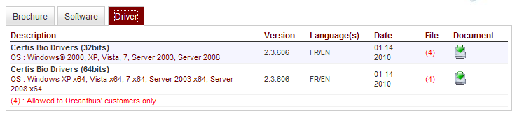
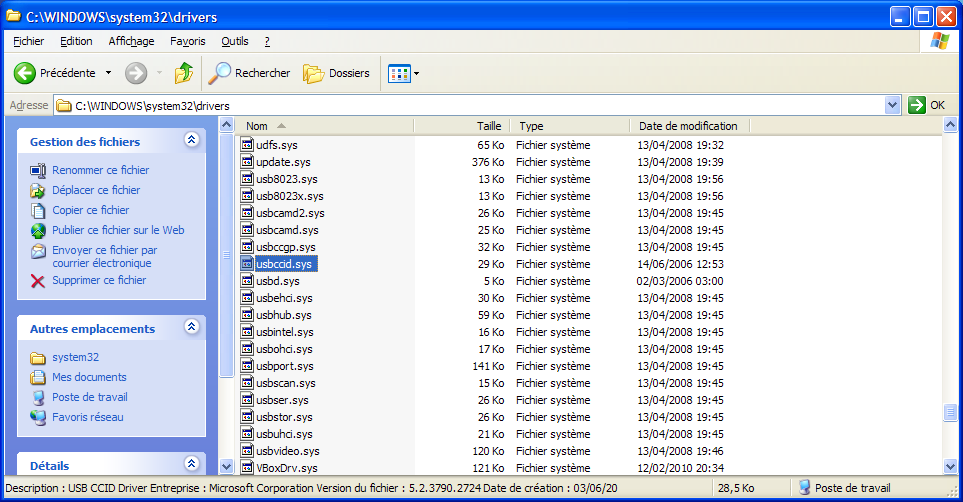



.. index::
   pair: CCID ; drivers x86_32
   pair: Windows ; x86

.. _windows_x86_USB_ccid_driver:

===========================
Windows x86 USB ccid driver
===========================

.. contents::
   :depth: 3

Introduction
============

La famille x86 regroupe les microprocesseurs compatibles avec le jeu
d'instructions de l'Intel 8086. Cette série est nommée IA-32 (pour
Intel architecture 32 bits) par Intel pour ses processeurs à partir
du Pentium.
Un constructeur de microprocesseur pour PC doit maintenir une compatibilité
ascendante avec ce jeu d'instruction s'il veut que les logiciels déjà
écrits fonctionnent sur les nouveaux microprocesseurs.

.. seealso::

   -  http://fr.wikipedia.org/wiki/X86

Certis Bio Driver example
=========================

Installation of the x86 usbccid driver under Vista and Windows 7
================================================================

.. code-block:: bash

    dpinst32.exe /q /f /path .

After installation, the id3usbccid.sys is under the "%systemroot%\\system32\\drivers" directory.

.. seealso:: :ref:`file_system_redirector`

Installation of the x86 usbccid driver under Windows XP
=======================================================

::

    DPInst.exe
    DPInst_32bits_usbccid_driver.bat
    install_usbccid_driver.bat
    usbccid.cat
    usbccid.inf
    usbccid.sys

+-----------------------------------+----------------------------------+------------------------------------------+---------------+
|              Fichier              |               MD5                |                   SHA1                   | Size in bytes |
+===================================+==================================+==========================================+===============+
| DPInst_32bits_usbccid_drivers.bat | 7a96d5e1cbc93e087488dcde08c23c8c | 303b7395c86760790d457be1d1ec8a8ae6a7539b |       27      |
+-----------------------------------+----------------------------------+------------------------------------------+---------------+
| usbccid.inf                       | 847d52826e564cc823a53133e97edebc | 435403d41cb143efffce801afa6a0778ebc1db1f |      1944     |
+-----------------------------------+----------------------------------+------------------------------------------+---------------+
| usbccid.cat                       | d76c27d0c43ae2ade72a737ee93d24bc | bc2ef1308c09d7931b402a93223dc48b260a1dcf |      7908     |
+-----------------------------------+----------------------------------+------------------------------------------+---------------+
| usbccid.sys                       | 2825e0e294686a26506690059e1f437a | 57abc95625625addb90d860210dbd3747ac8f881 |     29184     |
+-----------------------------------+----------------------------------+------------------------------------------+---------------+
| DPInst.exe                        | 3f442906b29b552f1c9fec1e221d90b7 | 77fa9f9255d8577aa28357f97e09838c9c43de34 |     795104    |
+-----------------------------------+----------------------------------+------------------------------------------+---------------+

.. code-block:: bash

    DPInst.exe -q -f /path .

After installation, the usbccid.sys is under the "%systemroot%\\system32\\drivers" directory.

.. seealso:: :ref:`dpinst_cli_switches`

.. seealso:: :ref:`file_system_redirector`

