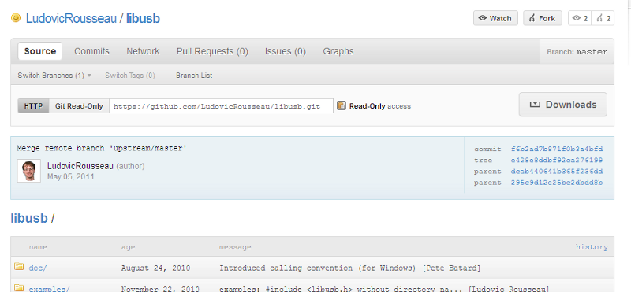
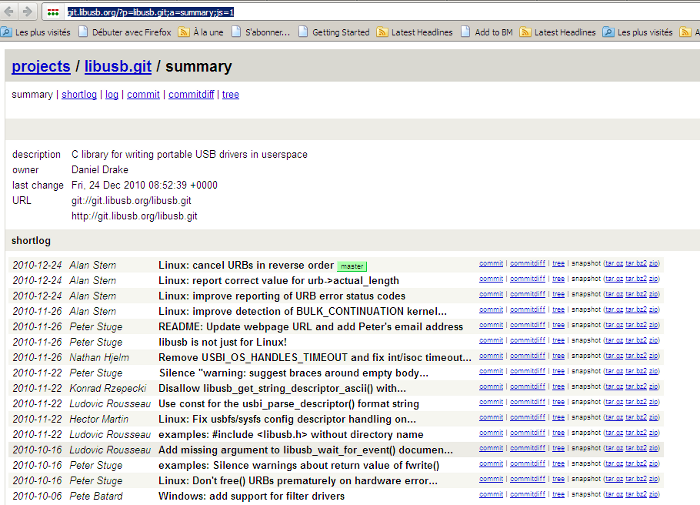
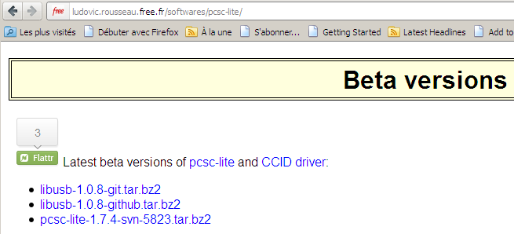



.. index::
   libusb maintenance problem
   maintenance libusb problem

.. _libusb_maintenance_problem:

==========================
libusb maintenance problem
==========================

.. seealso::

   - http://ludovicrousseau.blogspot.com/2011/03/new-version-of-libusb.html
   - http://ludovicrousseau.blogspot.com/2011/05/new-version-of-libusb-part-2.html

.. _libusb_july_2011_maintenance_problem:

libusb july 2011 maintenance problem
====================================

.. seealso:: http://sourceforge.net/mailarchive/forum.php?thread_name=CA572755.147C1%25kustaa.nyholm%40planmeca.com&forum_name=libusb-devel

::

    From: Pete Batard <pete@ak...> - 2011-07-28 09:21
    Just a couple of quick questions:

    1. Are you reading the libusb mailing list at all?
    2. If not, do you plan to be involved with libusb ever again?
    3. If not, could you please appoint a new project lead for libusb, with
    the ability to appoint maintainers?

    In case you haven't been following the situation, because of the lack of
    release, users are actively ditching libusb, and with a single project
    maintainer, arbitration seems unattainable.

    We need at least 3 different people, with either administrative or
    maintenance authority, to be actively involved in libusb in order to
    stop the current deadlock. As such your action is very much required.

    Regards,

    /Pete

.. _libusb_may_2011_maintenance_problem:

libusb may 2011 maintenance problem
===================================

.. seealso::

   - http://ludovicrousseau.blogspot.com/2011/05/new-version-of-libusb-part-2.html
   - https://github.com/LudovicRousseau/libusb

I an `previous blog article`_ I talked about the situation of libusb:

- a stable libusb has not been released since May 2010 (exactly one year ago)
- bugs are still open even if they have patches attached in the bug report

I already provide a git snapshot of the upstream (official) repository in the
file libusb-1.0.8-git.tar.bz2 from http://ludovic.rousseau.free.fr/softwares/pcsc-lite/.

I now also provide `a git snapshot of my own github version`_ with ticket #56 fixed
in the file libusb-1.0.8-github.tar.bz2.

.. _`previous blog article`:  http://ludovicrousseau.blogspot.com/2011/03/new-version-of-libusb.html

.. _`a git snapshot of my own github version`: https://github.com/LudovicRousseau/libusb

.. _libusb_march_2011_maintenance_problem:

libusb march 2011 libusb maintenance problem
============================================

.. seealso::

   - http://sourceforge.net/mailarchive/forum.php?thread_name=AANLkTinp3vS0bemKC4Us6-23g4QyaE%2BgRjS5MyuT1HNr%40mail.gmail.com&forum_name=libusb-devel

The latest version 1.0.8 of libusb-1.0 was released in `May 2010`_ (nearly a year ago).
Since then many bugs have been reported and most have been fixed in the
`git repository`_. The problem is that no new stable or 1.0.9 version has been
released since May 2010.
So if you suffer from a bug in libusb it is not easy to update it.

To ease the use of a more up-to-date version of libusb-1.0 I made a snapshot of
the version in the git repository and provide it on my web page of beta versions
or http://ludovic.rousseau.free.fr/softwares/pcsc-lite/

.. _`May 2010`: http://sourceforge.net/projects/libusb/files/libusb-1.0/
.. _`git repository`: http://sourceforge.net/projects/libusb/files/libusb-1.0/

libusb august 2011 maintenance problem
======================================

.. seealso:: http://sourceforge.net/mailarchive/forum.php?thread_name=CAGstE8BvGF-%3Dku0XGzg74aQj3PzUFj6yMT88FeJNBxHy0hhXrQ%40mail.gmail.com&forum_name=libusb-devel

::

    Hello Peter and others,

    Once again a user got hit by a bug in libusb 1.0.8 that is _already_ fixed.

    The user worked on the problem and wrote a patch for my program. The
    problem is not in my program but in libusb. Upgrading libusb solved
    the problem.

    He lost time identifying the problem.
    He lost time writing a patch.
    He lost time filling a bug [1].
    I lost time answering the bug.
    I lose time writing this email.

    So much time lost that could be used for something else.

    Peter, if you care (a little) about your users then please release
    libusb-1.0.9 as it is now. Many minutes/hours will be saved for many
    people.

    Thanks

.. seealso:: http://bugs.debian.org/cgi-bin/bugreport.cgi?bug=637022
