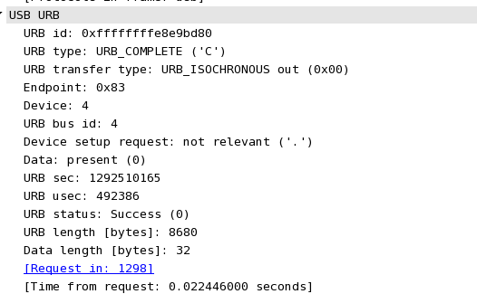



.. index::
   linux kernel for wireshark

==============================
new linux kernel for wireshark
==============================

.. warning::
   http://wiki.wireshark.org/CaptureSetup/USB

   For versions of the kernel prior to 2.6.21, the only USB traffic capture mechanism
   available is a text-based mechanism that limits the total amount of data captured
   for each raw USB block to about 30 bytes.
   There is no way to change this without patching the kernel.

How to install a new kernel on centOS
=====================================

.. seealso::

    - http://www.fogonacaixadagua.com.br/2009/09/how-to-compile-a-new-kernel-in-linux-centos-red-hat/
    - http://www.howtoforge.com/kernel_compilation_centos
    - http://wiki.centos.org/HowTos/Custom_Kernel
    - http://elrepo.org/tiki/kernel-ml
    - http://funky-dennis.livejournal.com/3290.html
    - http://people.centos.org/hughesjr/kernel-rt/i386/

Extract the sources
-------------------

::

    cd cd /dvcs_repositories/
    gunzip linux-2.6.31.14.tar.gz
    tar xvf linux-2.6.31.14.tar.gz -C /usr/src
    cd /usr/src
    ln -sf linux-2.6.31.14 linux
    ll

Results::

    drwxr-xr-x  2 root root 4096 jan 26  2010 debug
    drwxr-xr-x  2 root root 4096 jan 26  2010 kernels
    lrwxrwxrwx  1 root root   15 déc 17 09:07 linux -> linux-2.6.31.14
    drwxrwxr-x 23 root root 4096 jui  5 19:11 linux-2.6.31.14
    drwxr-xr-x  7 root root 4096 déc 16 16:57 redhat

Install the development tools
-----------------------------

::

    yum install gcc make bison ncurses-devel rpm-build

Results::

    [root@houx src]# yum install gcc make bison ncurses-devel rpm-build
    Loaded plugins: fastestmirror, priorities
    Loading mirror speeds from cached hostfile
    214 packages excluded due to repository priority protections
    Setting up Install Process
    Package gcc-4.1.2-48.el5.i386 already installed and latest version
    Package 1:make-3.81-3.el5.i386 already installed and latest version
    Package bison-2.3-2.1.i386 already installed and latest version
    Package ncurses-devel-5.5-24.20060715.i386 already installed and latest version
    Package rpm-build-4.4.2.3-20.el5_5.1.i386 already installed and latest version
    Nothing to do

Keep the old config
-------------------

> uname -r::

    2.6.18-194.26.1.el5

copy the old config file

::

    cd /usr/src/linux
    cp /boot/config-`uname -r`  .config

::

    [root@houx linux]# make menuconfig
      HOSTCC  scripts/basic/fixdep
      HOSTCC  scripts/basic/docproc
      HOSTCC  scripts/basic/hash
      HOSTCC  scripts/kconfig/conf.o
      HOSTCC  scripts/kconfig/kxgettext.o
      HOSTCC  scripts/kconfig/lxdialog/checklist.o
      HOSTCC  scripts/kconfig/lxdialog/inputbox.o
      HOSTCC  scripts/kconfig/lxdialog/menubox.o
      HOSTCC  scripts/kconfig/lxdialog/textbox.o
      HOSTCC  scripts/kconfig/lxdialog/util.o
      HOSTCC  scripts/kconfig/lxdialog/yesno.o
      HOSTCC  scripts/kconfig/mconf.o
      SHIPPED scripts/kconfig/zconf.tab.c
      SHIPPED scripts/kconfig/lex.zconf.c
      SHIPPED scripts/kconfig/zconf.hash.c
      HOSTCC  scripts/kconfig/zconf.tab.o
      HOSTLD  scripts/kconfig/mconf
    scripts/kconfig/mconf arch/x86/Kconfig
    .config:684:warning: symbol value 'm' invalid for IP_DCCP_CCID3
    .config:685:warning: symbol value 'm' invalid for IP_DCCP_TFRC_LIB
    .config:1424:warning: symbol value 'm' invalid for FIXED_PHY
    .config:1731:warning: symbol value 'm' invalid for ISDN
    .config:2865:warning: symbol value 'm' invalid for RTC_INTF_SYSFS
    .config:2866:warning: symbol value 'm' invalid for RTC_INTF_PROC
    .config:2867:warning: symbol value 'm' invalid for RTC_INTF_DEV
    .config:2889:warning: symbol value 'm' invalid for DMA_ENGINE
    .config:2943:warning: symbol value 'm' invalid for GFS2_FS_LOCKING_DLM

make rpm (RPM of the new kernel)
--------------------------------

    [root@houx linux]# make rpm
    HOSTLD  scripts/kconfig/conf
    scripts/kconfig/conf -s arch/x86/Kconfig
    /bin/sh /usr/src/linux-2.6.31.14/scripts/package/mkspec > /usr/src/linux-2.6.31.14/kernel.spec
    make clean
    set -e; cd ..; ln -sf /usr/src/linux-2.6.31.14 kernel-2.6.31.14id3_17_12_2010
    /bin/sh /usr/src/linux-2.6.31.14/scripts/setlocalversion > /usr/src/linux-2.6.31.14/.scmversion
    set -e; cd ..; tar -cz --exclude SCCS --exclude BitKeeper --exclude .svn --exclude CVS --exclude .pc --exclude .hg --exclude .git -f kernel-2.6.31.14id3_17_12_2010.tar.gz kernel-2.6.31.14id3_17_12_2010/.
    ...
    + cp arch/x86/boot/bzImage /var/tmp/kernel-2.6.31.14id3_17_12_2010-root/boot/vmlinuz-2.6.31.14id3_17_12_2010
    + cp System.map /var/tmp/kernel-2.6.31.14id3_17_12_2010-root/boot/System.map-2.6.31.14id3_17_12_2010
    + cp .config /var/tmp/kernel-2.6.31.14id3_17_12_2010-root/boot/config-2.6.31.14id3_17_12_2010
    + cp vmlinux vmlinux.orig
    + bzip2 -9 vmlinux
    + mv vmlinux.bz2 /var/tmp/kernel-2.6.31.14id3_17_12_2010-root/boot/vmlinux-2.6.31.14id3_17_12_2010.bz2
    + mv vmlinux.orig vmlinux
    + /usr/lib/rpm/brp-compress
    Traitement des fichiers: kernel-2.6.31.14id3_17_12_2010-1
    Provides: kernel-2.6.31.14id3_17_12_2010
    Requires(rpmlib): rpmlib(CompressedFileNames) <= 3.0.4-1 rpmlib(PayloadFilesHavePrefix) <= 4.0-1
    Vérification des fichiers non empaquetés: /usr/lib/rpm/check-files /var/tmp/kernel-2.6.31.14id3_17_12_2010-root
    Ecrit: /usr/src/redhat/SRPMS/kernel-2.6.31.14id3_17_12_2010-1.src.rpm
    Ecrit: /usr/src/redhat/RPMS/i386/kernel-2.6.31.14id3_17_12_2010-1.i386.rpm
    Exécution_de(%clean): /bin/sh -e /var/tmp/rpm-tmp.99947
    + umask 022
    + cd /usr/src/redhat/BUILD
    + cd kernel-2.6.31.14id3_17_12_2010
    + rm -rf /var/tmp/kernel-2.6.31.14id3_17_12_2010-root
    + exit 0
    rm ../kernel-2.6.31.14id3_17_12_2010.tar.gz

Installing the new kernel
-------------------------

::

    date; rpm -ivh /usr/src/redhat/RPMS/i386/kernel-2.6.31.14id3_17_12_2010-1.i386.rpm; date

Results

::

    [root@houx linux]# date; rpm -ivh /usr/src/redhat/RPMS/i386/kernel-2.6.31.14id3_17_12_2010-1.i386.rpm; date
    ven déc 17 10:49:53 CET 2010
    Préparation...              ########################################### [100%]
       1:kernel                 ########################################### [100%]
    ven déc 17 10:50:18 CET 2010

Confirming that the new kernel was installed

::

    ls /boot

::

    [root@houx linux]# ls /boot
    config-2.6.18-194.11.4.el5      initrd-2.6.18-194.11.4.el5.img  symvers-2.6.18-194.17.1.el5.gz      vmlinux-2.6.31.14id3_17_12_2010.bz2
    config-2.6.18-194.17.1.el5      initrd-2.6.18-194.17.1.el5.img  symvers-2.6.18-194.26.1.el5.gz      vmlinuz-2.6.18-194.11.4.el5
    config-2.6.18-194.26.1.el5      initrd-2.6.18-194.26.1.el5.img  System.map-2.6.18-194.11.4.el5      vmlinuz-2.6.18-194.17.1.el5
    config-2.6.31.14id3_17_12_2010  lost+found                      System.map-2.6.18-194.17.1.el5      vmlinuz-2.6.18-194.26.1.el5
    extlinux                        message                         System.map-2.6.18-194.26.1.el5      vmlinuz-2.6.31.14id3_17_12_2010
    grub                            symvers-2.6.18-194.11.4.el5.gz  System.map-2.6.31.14id3_17_12_2010
    [root@houx linux]#

Creating the initrd for the new kernel
--------------------------------------

::

    mkinitrd -v /boot/in
