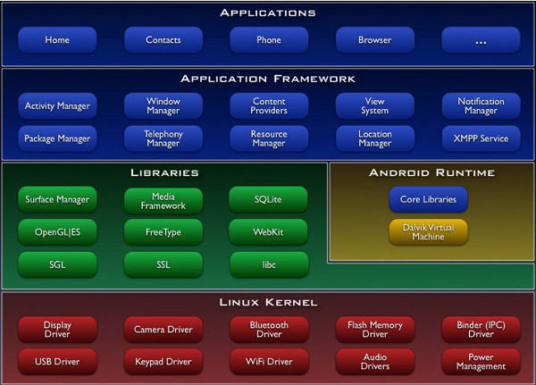

.. index::
   pair: JVM; dalvik
   pair: android; dalvik

.. _dalvik_java_virtual_machine:

=============================
Dalvik Java Virtual Machine
=============================

.. seealso::

   - http://en.wikipedia.org/wiki/Dalvik_virtual_machine
   - http://fr.wikipedia.org/wiki/Machine_virtuelle_Dalvik
   - :ref:`android_os`

   *System architecture*

Dalvik est la machine virtuelle utilisée dans les appareils mobiles Android.

Elle permet d'exécuter les applications qui peuvent être écrites en java et
converties en un exécutable compact Dalvik (.dex), format adapté aux systèmes
limités en termes de mémoire et de vitesse du processeur.

Dalvik a été écrit par Dan Bornstein qui l'a nommé d'après le village de
pêcheurs de Dalvík en Islande, où vivaient certains de ses ancêtres

Architecture
============

Unlike Java VMs, which are stack machines, the Dalvik VM is a **register-based architecture**.

A tool called dx is used to convert some (but not all) Java .class files into
the .dex format.

Multiple classes are included in a single .dex file. Duplicate strings and other
constants used in multiple class files are included only once in the .dex output
to conserve space.

Java bytecode is also converted into an alternative instruction set used by the
Dalvik VM.

An uncompressed .dex file is typically a few percent smaller in size than a
compressed .jar (Java Archive) derived from the same .class files.

The Dalvik executables may be modified again when installed onto a mobile device.
In order to gain further optimizations, byte order may be swapped in certain data,
simple data structures and function libraries may be linked inline, and empty
class objects may be short-circuited, for example.

As of Android 2.2, Dalvik has a just-in-time compiler.

Being optimized for low memory requirements, Dalvik has some specific
characteristics that differentiate it from other standard VMs:[5]

- The VM was slimmed down to use less space
- The constant pool has been modified to use only 32-bit indices to simplify
  the interpreter
- Standard Java bytecode executes 8-bit stack instructions. Local variables must
  be copied to or from the operand stack by separate instructions. Dalvik instead
  uses its own 16-bit instruction set that works directly on local variables.
  The local variable is commonly picked by a 4-bit 'virtual register' field.
  This lowers Dalvik's instruction count and raises its interpreter speed.

Moreover, according to Google, Dalvik has been designed so that a device can run
multiple instances of the VM efficiently
