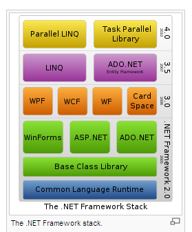

.. index::
   pair: .NET ; Framework
   pair: DotNet ; Framework

.. _dotnet_framework:

==================================
DotNet Framework (.NET Framework)
==================================

.. seealso::

   - http://fr.wikipedia.org/wiki/.NET_Framework
   
   
   

   *Dotnet logo*

   *Dotnet stack*

.. contents::
   :depth: 3

Description
===========

English
--------

The .NET Framework (pronounced dot net) is a software framework that runs
primarily on Microsoft Windows.

It includes a large library and supports several programming languages which
allows language interoperability (each language can use code written in other
languages).

Programs written for the .NET Framework execute in a software environment (as
contrasted to hardware environment), known as the Common Language Runtime (CLR),
an application virtual machine that provides important services such as security,
memory management, and exception handling.

The class library and the CLR together constitute the .NET Framework.

Français
---------

Le .NET Framework1 est un framework pouvant être utilisé par un système 
d'exploitation Microsoft Windows et Microsoft Windows Mobile depuis la version 5 
(.NET Compact Framework). 

Une version légère et limitée fournie avec un moteur d'exécution fonctionnant 
à l'intérieur d'un navigateur ou d'un périphérique mobile est disponible sous 
le nom de Silverlight. 

La version 3.0 du framework est intégrée à Windows Vista et à la plupart des 
versions de Windows Server 2008 ou téléchargeable depuis le site de 
l'éditeur Microsoft.

Dotnet compilers
=================

.. toctree::
   :maxdepth: 4
   
   
   compilers/index
   

Dotnet flavors
===============

.. toctree::
   :maxdepth: 4

   compact/index
   standard/index
