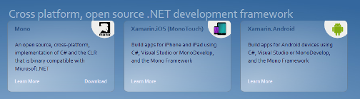

.. index::
   pair: Framework; Mono
   ! Mono

.. _mono_framework:
.. _mono:

========================
Mono project
========================

.. seealso::

   - http://www.mono-project.com/Main_Page

.. contents::
   :depth: 3
   

Introduction
============

``Mono`` is a free and open source project led by Xamarin (formerly by Novell and
originally by Ximian) to create an Ecma standard compliant .NET
Framework-compatible set of tools including, among others, a C# compiler and a
Common Language Runtime.

The stated purpose of Mono is not only to be able to run Microsoft .NET
applications cross-platform, but also to bring better development tools to
Linux developers.

Mono can be run on many operating systems including Android, BSD, iOS, Linux,
OS X, Windows, Solaris, Unix, and some for game consoles such as PlayStation 3,
Wii, and Xbox 360.

Community
=========

Blogs
-----

.. seealso:: 

   - http://www.go-mono.com/monologue/

xamarin
========

.. toctree::
   :maxdepth: 4

   xamarin/index

Mono versions
===============

.. toctree::
   :maxdepth: 4

   versions/index
