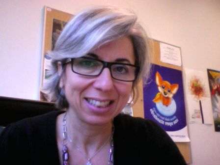
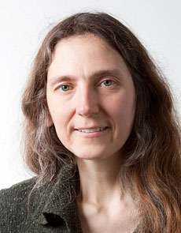
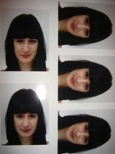
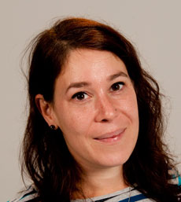



===============================
Mardi 4 décemnbre (Fossa 2012)
===============================

.. contents::
   :depth: 5

.. seealso::

   - http://fossa.inria.fr/fr/archives/category/program

08:45 Welcome coffee
====================

09:15 Welcome message
=====================

by Euratechnologies and Inria

09:30 Return on Experience, université du Littoral, Master I2L
==============================================================

by Cyril Fonlupt

10:00 Enseignement Mozilla à l’Université d’Evry
=================================================

by Didier Courtaud, Judith Benzakki

Judith Benzakki
---------------

.. seealso::

   - http://www.ibisc.univ-evry.fr/~judith/
   - http://bonjourmozilla.fr/?post/2010/11/18/Judith-Benzakki

Bonjour Mozilla a l’honneur de vous présenter aujourd’hui Judith Benzakki.
Judith Benzakki est la directrice de la MIAGE de l’Université d’Evry (dans l’Essonne).

Passionnée, volontaire, Judith a beaucoup de qualités, mais elle n’est pas
parfaite puisqu’elle enseigne le Java (saymal).

Toutefois, avec Didier « Desiderius » Courtaud elle est aussi à l’origine du
projet CoMETE, qui consiste à enseigner les technologies Mozilla à aux étudiants
MIAGE (saroxxe).

Projet Comete
+++++++++++++

.. seealso::

   - http://ljouanneau.com/blog/post/2012/12/10/Firefox-OS-%C3%A7a-va-depoter
   - http://kazhack.org/

10:30 Coffee break
==================

10:45 To be defined
===================

by to be defined

11:15 Site du Zero – Project CLAIRE
===================================

.. seealso::

   - http://fossa.inria.fr/archives/3478
   - http://www.projet-claire.fr/
   - http://www.siteduzero.com/

Mathieu Nebra
-------------

Mathieu Nebra - alias M@teo21 Fondateur du Site du Zéro.

Jeune passionné de nouvelles technologies, il cherche en vain en librairie des
cours accessibles aux débutants pour se former.

Afin de prouver que l’on peut faire “plus clair et plus simple”, il crée le
Site du Zéro, aujourd’hui devenu la référence des cours pour débutants en ligne
avec plusieurs millions de visites par mois.

Ses précédents ouvrages sur la programmation sont aujourd’hui des best-sellers
et ont permis à de nombreux débutants de se former sur le C, le C++, HTML5,
CSS3, PHP, MySQL, ...

CLAIRE
------

A quoi ressemblerait l'enseignement si nous l'inventions avec les technologies
d'aujourd'hui ?

Repenser les méthodes pédagogiques pour bénéficier pleinement des technologies
numériques : c'est l'objectif du projet CLAIRE.

Que vous soyez un enseignant, une entreprise ou un développeur Open Source, vous
pouvez suivre, commenter, relayer nos travaux. Vous pourrez par la suite
contribuer au projet en nous aidant à le développer et à le tester.

CLAIRE est un projet commun de R&D lancé par une entreprise et des laboratoires
de recherche de renom dans l'enseignement et les technologies numériques :
Simple IT (créateur de www.siteduzero.com), le LIRIS et l'INRIA Grenoble.

Simple IT, porteur du projet
----------------------------

Simple IT est une Jeune Entreprise Innovante fondée en 2007 et spécialisée dans
la création, l'édition et la publication de contenus pédagogiques (web, livres...),
essentiellement dans le domaine de l'informatique.

Son activité historique est l'exploitation du Site du Zéro (www.siteduzero.com),
un site de cours gratuits pour débutants, créé en 1999 par Mathieu Nebra,
associé de Simple IT, et réunissant 4 000 000 visites par mois.

Son savoir-faire est tant pédagogique que technique. De nombreuses innovations
ont été lancées par Simple IT après d'importants travaux de R&D autour du
multimédia web, de la publication multi-supports, de la rédaction collaborative
et de la gestion communautaire de contenus.

11:45 DEBATE
=============

by Colin de la Higuera

12:30 Lunch
===========

14:00 IRILL: Scope & achievements in the first two years (2010-2012)
====================================================================

.. seealso::

   - http://fossa.inria.fr/fr/archives/2976

IRILL
-----

.. seealso::

   - http://fr.wikipedia.org/wiki/IRILL

L'Initiative pour la Recherche et l'Innovation sur le Logiciel Libre, IRILL, est
un laboratoire de recherche français.

Ce centre a été créé en septembre 2010 par l'INRIA avec l'Université
Pierre-et-Marie-Curie et l'Université Paris VII - Diderot et localisé dans les
locaux de l'INRIA à Paris1.

Roberto Di Cosmo est le directeur d'IRILL.

IRILL vise à fournir des ressources pour des acteurs du logiciel libre comme des
chercheurs, des développeurs ou des industriels. Le centre aide aussi au
transfert technologique vers des petites et moyennes entreprises tout en
améliorant la manière dont les développements FLOSS sont réalisés et enseignés.

Trois projets sont hébergés par IRILL au moment de sa création:

- MANCOOSI (MANaging the COmplexity of the Open Source Infrastructure)
- Coccinelle (logiciel)
- Ocsigen

IRILL est aussi impliqué dans des projets majeurs comme GCC, Debian, Scilab ou
OCaml.

L'IRILL organise régulièrement des conférences majeures dans ses locaux comme
la rencontre des hackers GNU du 25 au 28 août 2011 ou la première conférence
LibreOffice.

Roberto Di Cosmo
----------------

.. seealso::

   - http://www.dicosmo.org/
   - https://twitter.com/rdicosmo
   - http://fr.wikipedia.org/wiki/Roberto_Di_Cosmo

Roberto Di Cosmo est un chercheur informaticien italien, installé en France,
membre du laboratoire Preuves, Programmes et Systèmes de l'Université Paris Diderot.

Il est diplômé de la Scuola Normale Superiore de Pise et a soutenu sa thèse de
doctorat à l'Université de Pise, avant de devenir maître de conférences à
l'École normale supérieure à Paris, puis professeur à l'Université Paris
VII-Denis-Diderot.

Depuis septembre 2010, il est le directeur du laboratoire IRILL (Initiative pour
la Recherche et l'Innovation sur le Logiciel Libre).

Membre de l'AFUL, l'association francophone des utilisateurs de Linux et des
logiciels libres, il fait régulièrement des conférences sur des sujets liés au
logiciel libre.

Il a été l'un des porteurs, en tant que président du bureau provisoire, du projet
de Pôle de compétitivité Ouverture, consacré au logiciel libre sur la région
Paris-Île-de-France, récemment intégré au sein du pôle System@tic.

Il est devenu célèbre lors de la publication sur le Net d'un pamphlet en 1998 :
Piège dans le cyberespace.

Il est coauteur d'un livre avec la journaliste Dominique Nora : Le Hold-up
planétaire : la face cachée de Microsoft. Ce livre est aujourd'hui disponible
gratuitement sous licence Creative Commons BY-NC-ND.

Une de ses grandes contributions à Linux est, également, la diffusion de la
première distribution « live » (de 2000 à 2002) : demoLinux, permettant d'utiliser
Linux à partir d'un CD-ROM, sans installation.

Le 13 septembre 2011, Jérôme Vouillon et Robert di Cosmo ont remporté le prix
« Microsoft Research Distinguished Artefact Award.

14:30 Coccinelle: Automatic, Scriptable Evolutions & Bug Finding for C Code
============================================================================

Julia Lawall
------------

.. seealso::

   - http://fossa.inria.fr/archives/2745
   - https://consortium.gephi.org/
   - http://interstices.info/jcms/int_69682/le-logiciel-libre-dans-la-recherche
   - http://www.dailymotion.com/video/xu1z98_coccinelle-julia-lawall-kernel-recipes-12_tech
   - http://pagesperso-systeme.lip6.fr/Julia.Lawall/

Julia Lawall (LIP6) nous parle de Coccinelle, un outil de bug finding.

Coccinelle permet de rechercher et corriger des bugs dans le code. Il a été
utilisé très fréquemment sur le code du kernel et pour automatiser des évolutions
du code source.

15:00 Ocsigen: Rethinking Web Programming
==========================================

.. seealso::

   - http://fossa.inria.fr/fr/archives/2742
   - http://ocsigen.org/

The Web has evolved from a content platform to an application platform.

Most Web programming tools are not fully adapted to this evolution.

The Ocsigen project aims at creating a new integrated way to design
modern Web sites as distributed applications. It makes possible to
program both the client and server parts of a Web app in the same
language, OCaml, and as a single program.

It introduces an abstraction from the underlying technologies in order
to make very easy to program complex Web interaction. It also makes use
of advanced static typing features to ensure the robustness of programs
and the compliance with standards.

This also reduces a lot the debugging time. The talk will give an
overview of the project and a demo of how to build a small application.

Vincent Balat
-------------

Vincent Balat

- Lecturer (maître de conférences) at University Paris Diderot
- Founder and leader of the Ocsigen project
- He graduated from the École Normale Supérieure de Cachan.
- His research is mainly devoted to improving the
  expressiveness and reliability of programming languages.

15:30 Bootstrapping Debian
===========================

.. seealso::

   - http://fossa.inria.fr/fr/archives/2897

Bootstrapping Debian for a new hardware platform has so far been a manual task
often involving months of work because neither cross compilation nor compilation
of source packages with reduced dependencies is supported by Debian.

Packages have to be cross compiled to provide a minimal native compilation
environment. Packages have to be built with reduced dependencies to break
build dependency cycles.

In this talk I will present progress being made to find a semi automatic way
break dependency cycles, new metrics to pinpoint problematic packages and tools
developed to aid developers to enrich package’s meta-data.

Pietro Abate
------------

16:00 Coffee break
===================

16:30 Enjeux de l’histoire du Libre
====================================

.. seealso::

   - http://fossa.inria.fr/fr/archives/2906

There are few book focusing on free/libre software and culture with a
historical perspective, although it can be considered as a tool for a
much comprehensive approach of computer and computer science histories.

Here are the main issues of this collective book, which propose an
history and archeology of free/libre software, with a focus on the
technological, sociological, legal, political and cultural aspects.

Christophe Masutti
------------------

.. seealso::

   - http://framasoft.org

- Historien des sciences et des technologies.
- Chercheur associé au SAGE (Sociétés, Acteurs, Gouvernements en Europe)
  à l’Université de Strasbourg.
- Responsable des affaires européennes à la Direction générale des
  Hôpitaux Universitaires de Strasbourg.
- Président de l’association Framasoft depuis janvier 2012.

Camille Paloque-Berges
----------------------

.. seealso::

   - http://fossa.inria.fr/fr/archives/2906
   - http://www.theatre-video.net/video/Folklore-du-web-1-5-Rencontre-avec-Camille-Paloques-Berges
   - http://cpbnews.tumblr.com/
   - http://www.webarchivists.org/
   - https://twitter.com/webarchivists

Docteure en Sciences de l’information et de la communication et
actuellement Post-doctorante LabEx HASTEC – DICEN (CNAM).

Travaille sur l’histoire d’Internet et des pratiques de communication
en réseau.

Membre des associations WebArchivists.org et Patrimoine Belfortain de
l’industrie informatique (PB2i).

Auteure de Poétique des codes (Archives contemporaines, 2009).

Benjamin Jean
--------------

Membre de l’équipe du CUERPI (Centre Universitaire d’Enseignement et de
Recherches en Propriété Intellectuelle), cofondateur de la société Inno,
consultant au cabinet Gilles Vercken et maître de conférences
à Sciences Po.

Cofondateur de l’association Veni, Vidi, Libri et du cycle de
conférences European OpenSource & free software Law Event (EOLE).

.. index::
   pair: Valérie ; Schafer

17:00   Des réseaux ouverts, pour quoi faire ?
===============================================

.. seealso:: http://fossa.inria.fr/fr/archives/2922

Valérie Schafer
---------------

.. seealso::

   - http://interstices.info/jcms/int_70662/a-propos-de-la-neutralite-dinternet

Chargée de recherche, Institut des sciences de la communication du CNRS (Paris)

- Historienne.
- Auteure de La France en réseaux (années 1960/1980) et Le Minitel, l’enfance
  numérique de la France avec Benjamin Thierry.
- Organisatrice avec Fanny Georges du séminaire Histoires de l’Internet à l’ISCC.

17:30 Le libre avant le Libre : les clubs d’utilisateurs d’ordinateurs
======================================================================

Pierre-Eric Mounier Kuhn
------------------------

18h Movie – Revolution OS
==========================

.. seealso::

   - http://fossa.inria.fr/events/movie-revolution-os

For the past two decades, a loosely organized group of computer hackers,
neo-communists and entrepreneurs has led the charge in a technological revolution
that is undermining Microsoft’s monopoly and fundamentally changing the way
software is developed and owned.

Filmed in 35mm Cinemascope, REVOLUTION OS explores the Open Source movement’s
origins through original interviews with its founders, and depicts the grassroots
nature of the LINUX operating system and Open Source as they march into the mainstream.

19:20 Debate
============

.. seealso::

   - http://fr.wikipedia.org/wiki/Framasoft

by Alexis Kaufmann, Framasoft

20:00 End
=========

