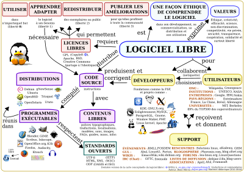


.. index::
   ! Free software
   pair: Logiciel ; Libre
   ! Logiciel Libre

.. _free_software:

=============================
Logiciel libre, Free software
=============================

.. seealso::

   - https://secure.wikimedia.org/wikipedia/fr/wiki/Free_software

.. contents::
   :depth: 3

Introduction
============

Un logiciel libre est un logiciel dont l'utilisation, l'étude, la modification
et la duplication en vue de sa diffusion sont permises (techniquement et légalement).

Conferences sur le Libre
========================

.. toctree::
   :maxdepth: 4

   conferences/index

Free software international
===========================

.. toctree::
   :maxdepth: 4

   international/index

Libre people
==============

.. toctree::
   :maxdepth: 4

   people/index

Livres sur le Libre
========================

.. toctree::
   :maxdepth: 4

   books/index

