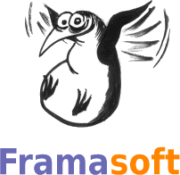


.. index::
   pair: Libre Associations; Framasoft
   ! APRIL

.. _framasoft:

=========
Framasoft
=========

.. seealso::

   - http://fr.wikipedia.org/wiki/Framasoft
   - http://www.framasoft.net/
   - http://www.framablog.org/index.php

   *Logo Framasoft*

Issu du monde éducatif, Framasoft est un réseau de sites web collaboratifs à
géométrie variable dont le dénominateur commun est le logiciel libre, sa culture
et son état d'esprit.

Il vise à diffuser le logiciel libre et à le faire connaître auprès du plus
large public.

Lieu d'orientation, d'informations, d'actualités, d'échanges et de projets,
Framasoft, de par la diversité et le dynamisme de son réseau, est aujourd'hui
l'une des principales portes d'entrée francophones du logiciel libre.

Sa communauté d'utilisateurs est créatrice de ressources et apporte assistance
et conseil à ceux qui découvrent et font leur premiers pas avec les logiciels
libres.

Elle accompagne ceux qui désirent remplacer leurs logiciels propriétaires par
des logiciels libres en attachant une attention toute particulière au processus
de migration du système d'exploitation Microsoft Windows vers GNU/Linux.

**Tout ce qui est produit est placé sous licence libre, favorisant ainsi la
participation et garantissant que le travail effectué demeurera sans
appropriation au bénéfice de tous**.

Framasoft a été créé en novembre 2001 par Alexis Kauffmann. En janvier 2004 une
association homonyme a vu le jour pour soutenir le développement du réseau.

