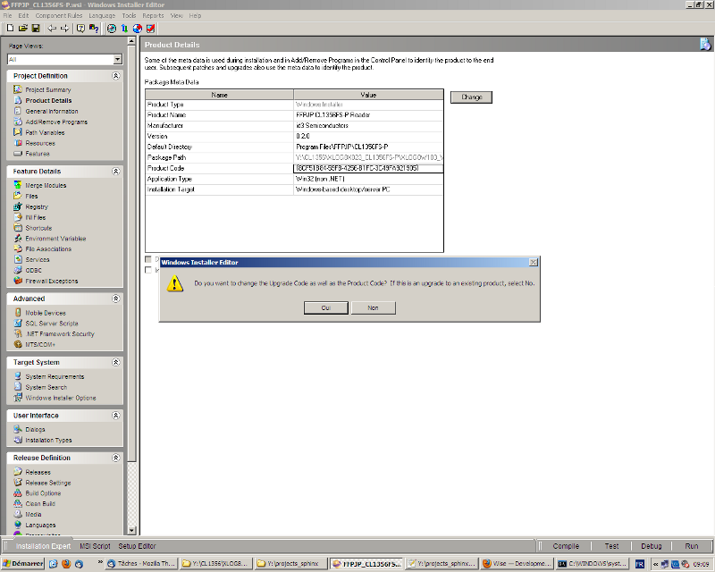



.. index::
   pair: Installer; Wise

.. _wise_installer:

========================
Wise (Altiris, symantec)
========================

.. seealso::

   - https://secure.wikimedia.org/wikipedia/en/wiki/Wise_Solutions,_Inc.

.. contents::
   :depth: 3

Introduction
============

Wise Solutions, Inc. is an American company that makes software tools for
creating application installers. Their primary product, Wise was one of
the most widely used installation packages for Windows. Their main competitor
is InstallShield by Flexera Software. Wise Solutions was acquired and became
a wholly owned subsidiary of Altiris, Inc. in December 2003.

In 2007, Altirishas been acquired by Symantec Corporation.

Wise Solutions was started as a shareware tool originally distributed via CompuServe.
Over time the company grew to roughly 300 employees spread across the headquarters
in Plymouth, Michigan and a European office in The Hague, Netherlands.
After the 2003 acquisition by Altiris the European office was consolidated with
an existing European Altiris office. The Plymouth Michigan office is now primarily
a regional software development and support site for existing Wise branded products
and some Altiris branded products.

Comment passer d’une version à l’autre
======================================

Conserver l’upgrade code:

- {3795FA12-513E-4129-98AB-18D212FE92A2} pour CL1356A
- {81BA2998-64AF-4189-888E-98E927647AF3} pour CL1356T/T5

puis Incrémenter le product code.

Comme on peut le voir sur l'image ci-dessus, il faut cliquer
sur 'Non'.

