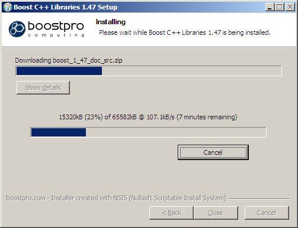



.. index::
   pair: Boost ; C++ libraries installation

================================
Boost C++ libraries installation
================================

.. seealso:: http://www.boostpro.com/download/

Installation on windows with mingw
==================================

Install in 2 steps when we use

1. go to C:\boost_1_47_0\tools\build\v2 and type::

    bootstrap.bat

2. Open the cmd.exe windows and type::

    C:\boost_1_47_0>bjam.exe --toolset=gcc --build-type=complete

Installation on GNU/Linux
=========================

.. seealso:: http://www.boost.org/doc/libs/1_47_0/more/getting_started/unix-variants.html

::

    /opt/boost/current$  su -c "./bootstrap.sh --prefix=/opt/boost/1.47.0/lib"

::

    Building Boost.Build engine with toolset gcc... tools/build/v2/engine/bin.linuxx86/b2
    Detecting Python version... 2.7
    Detecting Python root... /usr
    Unicode/ICU support for Boost.Regex?... not found.
    Generating Boost.Build configuration in project-config.jam...
    Bootstrapping is done. To build, run:

    ./b2
    To adjust configuration, edit 'project-config.jam'.
    Further information:
    - Command line help:
     ./b2 --help
   - Getting started guide:
     http://www.boost.org/more/getting_started/unix-variants.html
   - Boost.Build documentation:
     http://www.boost.org/boost-build2/doc/html/index.html

    The Boost C++ Libraries were successfully built!
    The following directory should be added to compiler include paths:

    /opt/boost/1.47.0

    The following directory should be added to linker library paths:

    /opt/boost/1.47.0/stage/lib

