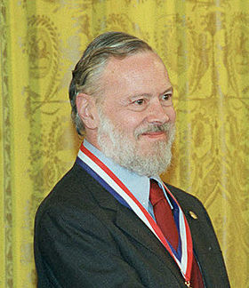



.. index::
   C (Dennis Ritchie)

.. _dennis_ritchie:

================================
c language people Dennis Ritchie
================================

.. seealso::

   - https://fr.wikipedia.org/wiki/Dennis_Ritchie
   - :ref:`fedora16_dedicated_to_dennis_ritchie`

Dennis MacAlistair Ritchie, né le 9 septembre 1941 à Bronxville dans l'État de
New York et trouvé mort le 12 octobre 2011 à Berkeley Heights dans le
New Jersey, est un des pionniers de l'informatique moderne, inventeur du
langage C et co-développeur de Unix.

Il est parfois désigné par dmr, son adresse e-mail aux Laboratoires Bell.

Au début des années 1970, il travaille avec Ken Thompson en tant que
programmeur dans les Laboratoires Bell sur le développement d'Unix.

Pour Unix, il s'avère nécessaire d'améliorer le langage B créé par Ken Thompson
et c'est ainsi que Ritchie crée le langage C. Par la suite, aidé de Brian Kernighan,
il promeut le langage et rédige notamment le livre de référence
The C Programming Language.

Il reçoit conjointement avec Ken Thompson le prix Turing de l'ACM en 1983 pour
leur travail sur le système Unix.

Dennis Ritchie nous a quitté
============================

.. seealso:: https://www.april.org/dennis-ritchie-nous-quitte

Dennis M. Ritchie, l'un des plus grands contributeurs de l'informatique moderne
nous a quitté.

Ce que Dennis Ritchie a apporté à l'informatique est difficile à quantifier.
En effet, dans les années 70, alors qu'il est employé par les laboratoires Bell,
il travaille avec Ken Thompson sur un projet de système d'exploitation dont
les qualités devaient être la portabilité, notamment vers des machines de
toute dimension. Pour cela, il conçoit un nouveau langage de programmation
dérivé du langage B de Ken Thompson et du BCPL de Martin Richards.

Ce langage et ce système d'exploitation ne sont autre que le langage C et Unix.
Ce langage se révèle complet et extrêmement performant et son usage dépassera
rapidement la cadre de la programmation sous Unix.

Pour présenter son nouveau langage, Dennis M. Ritchie écrira avec Brian Kernighan,
l'un des plus beaux ouvrage de programmation : **The C programming Language**.

Les auteurs y présentent toute la philosophie, les références du langage et des
exercices, entraînant ainsi le lecteur vers la maîtrise progressive de ce langage.
De ce livre, le K&R pour les informaticiens, on retiendra également le mythique
premier exemple, qui est sans aucun doute la ligne de code la plus connue de
tous les développeurs : printf("hello, world\n");

Le langage C est aujourd'hui toujours très utilisé pour ses performances et sa
portabilité. Il est la souche de nombreux autres langages : le C++,
l'Objective C cher à Apple, le C# de Microsoft, le Java et même le PHP en
tirent leurs racines. L'immense majorité des projets libres sont basés sur
ces langages. Du côté des systèmes d'exploitation, l'Unix de Ritchie et Thompson
est la souche de nombreux systèmes libres tels que Minix, GNU/Linux, FreeBSD,
NetBSD, OpenBSD.

Il est difficile d'imaginer ce que serait l'informatique d'aujourd'hui sans les
travaux de Dennis Ritchie. Pour ne donner qu'un exemple, le système
d'exploitation Android de Google, pour les smartphones et les tablettes, est
basé sur un noyau Linux et sur le langage Java, dérivés respectivement d'Unix
et du langage C.

Dennis M. Ritchie est décédé à l'âge de 70 ans. Homme d'une grande modestie,
il constitue pour de nombreux informaticiens un exemple de technique et de
partage du savoir au travers de l'un des plus beaux traité d'informatique.

L'April, et plus généralement la communauté du Libre, lui rendent
aujourd'hui hommage.

