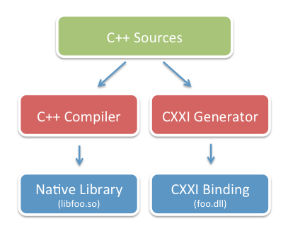
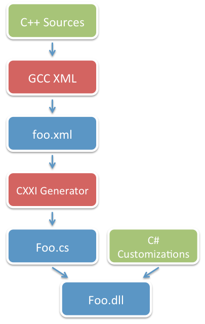


.. index::
   pair: C# bindings; cxxi
   triple: interop; C#; C++
   pair: toolchain; CXXI

.. _cxxi:

===================================
CXXI: Briding the C++ and C# worlds
===================================

.. seealso::

   - http://github.com/mono/cxxi
   - http://tirania.org/blog/archive/2011/Dec-19.html

The Mono runtime engine has many language interoperability features but has
**never had a strong story to interop with C++**.

Thanks to the work of Alex Corrado, Andreia Gaita and Zoltan Varga, this is about to change.

The short story is that the new CXXI technology allows C#/.NET developers to:

- Easily consume existing C++ classes from C# or any other .NET language
- Instantiate C++ objects from C#
- Invoke C++ methods in C++ classes from C# code
- Invoke C++ inline methods from C# code (provided your library is compiled with
  ``-fkeep-inline-functions`` or that you provide a surrogate library)
- Subclass C++ classes from C#
- Override C++ methods with C# methods
- Expose instances of C++ classes or mixed C++/C# classes to both C# code and
  C++ as if they were native code.

CXXI is the result of two summers of work from Google's Summer of Code towards
improving the interoperability of Mono with the C++ language.

The Alternatives
================

This section is merely a refresher of of the underlying technologies for
interoperability supported by Mono and how developers coped with C++ and C#
interoperability in the past. You can skip it if you want to get to how to
get started with CXXI.

As a reminder, Mono provides a number of interoperability bridges, mostly inherited from the ECMA standard. These bridges include:

- The bi-directional "Platform Invoke" technology (P/Invoke) which allows managed
  code (C#) to call methods in native libraries as well as support for native
  libraries to call back into managed code.
- COM Interop which allows Mono code to transparently call C or C++ code defined
  in native libraries as long as the code in the native libraries follows a few
  COM conventions.
- A general interceptor technology that can be used to intercept method
  invocations on objects.

How CXXI Works
==============

Accessing C++ methods poses several challenges. Here is a summary of the
components that play a major role in CXXI:

- Object Layout: this is the binary layout of the object in memory. This will
  vary from platform to platform.
- VTable Layout: this is the binary layout that the C++ compiler will use for a
  given class based on the base classes and their virtual methods.
- Mangled names: non-virtual methods do not enter an object vtable, instead
  these methods are merely turned into regular C functions. The name of the C
  functions is computed based on the return type and the parameter types of the
  method. These vary from compiler to compiler.

For example, given this C++ class definition, with its corresponding
implementation::

    class Widget {
    public:
        void SetVisible (bool visible);
        virtual void Layout ();
        virtual void Draw ();
    };

    class Label : public Widget {
    public:
        void SetText (const char *text);
        const char *GetText ();
    };

The C++ compiler on my system will generate the following mangled names for the
SetVisble, Layout, Draw, SetText and GetText methods::

    __ZN6Widget10SetVisibleEb
    __ZN6Widget6LayoutEv
    __ZN6Widget4DrawEv
    __ZN5Label7SetTextEPKc
    __ZN5Label7GetTextEv

The following C++ code::

    Label *l = new Label ();
    l->SetText ("foo");
    l->Draw ();

Is roughly compiled into this (rendered as C code)::

    Label *l = (Label *) malloc (sizeof (Label));
    ZN5LabelC1Ev (l);   // Mangled name for the Label's constructor
    _ZN5Label7SetTextEPKc (l, "foo");

    // This one calls draw
    (l->vtable [METHOD_PTR_SIZE*2])();

For CXXI to support these scenarios, it needs to know the exact layout for the
vtable, to know where each method lives and it needs to know how to access a
given method based on their mangled name.

The following chart explains shows how a native C++ library is exposed to C# or
other .NET languages:

   *chart explains shows how a native C++ library is exposed to C# or other .NET languages*

Your C++ source code is compiled twice. Once with the native C++ compiler to
generate your native library, and once with the CXXI toolchain.

Technically, CXXI only needs the header files for your C++ project, and only
the header files for the APIs that you are interested in wrapping. This means
that you can create bindings for C++ libraries that you do not have the source
code to, but have its header files.

The CXXI toolchain produces a .NET library that you can consume from C# or
other .NET languages. This library exposes a C# class that has the following
properties:

- When you instantiate the C# class, it actually instantiates the underlying C++ class.
- The resulting class can be used as the base class for other C# classes. Any
  methods flagged as virtual can be overwritten from C#.
- Supports C++ multiple inheritance: The generated C# classes expose a number
  of cast operators that you can use to access the different C++ base classes.
- Overwritten methods can call use the "base" C# keyword to invoke the base class
  implementation of the given method in C++.
- You can override any of the virtual methods from classes that support multiple
  inheritance.
- A convenience constructor is also provided if you want to instantiate a
  C# peer for an existing C++ instance that you surfaced through some other mean.

This is pure gold
=================

The CXXI pipeline in turn is made up of three components, as shown in the diagram
on the right.

   *CXXI pipeline in turn is made up of three components*

The GCC-XML compiler is used to parse your source code and extract the vtable
layout information. The generated XML information is then processed by the CXXI
tooling to generate a set of partial C# classes that contain the bridge code to
integrate with C++.

This is then combined with any customization code that you might want to add
(for example, you can add some overloads to improve the API, add a ToString()
implementation, add some async front-ends or dynamic helper methods).

The result is the managed assembly that interfaces with the native static library.

It is important to note that the resulting assembly (Foo.dll) does not encode
the actual in-memory layout of the fields in an object. Instead, the CXXI binder
determines based on the ABI being used what the layout rules for the object are.
This means that the Foo.dll is compiled only once and could be used across
multiple platforms that have different rules for laying out the fields in memory.

Future Work
===========

CXXI is not finished, but it is a strong foundation to drastically improve the
interoperability between .NET managed languages and C++.

Currently CXXI achieves all of its work at runtime by using System.Reflection.Emit
to generate the bridges on demand. This is useful as it can dynamically detect
the ABI used by a C++ compiler.

One of the projects that we are interested in doing is to add support for static
compilation, this would allow PS3 and iPhone users to use this technology.
It would mean that the resulting library would be tied to the platform on which
the CXXI tooling was used.

CXXI currently implements support for the GCC ABI, and has some early support
for the MSVC ABI. Support for other compiler ABIs as well as for completing the
MSVC ABI is something that we would like help with.

Currently CXXI only supports deleting objects that were instantiated from
managed code. Other objects are assumed to be owned by the unmanaged world.
Support for the delete operator is something that would be useful.

We also want to better document the pipeline, the runtime APIs and improve the
binding.

