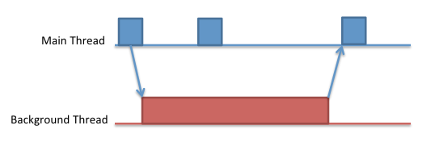



.. index::
   pair: Miguel de Icaza; Multithreading

.. _advices_csharp_multithreading:

==================================================
Advices from Miguel de Icaza about multithreading
==================================================

.. seealso:: http://tirania.org/monomac/archive/2012/Sep-10.html

**No major UI toolkit is thread safe.**

This means that these toolkits are not designed to have their exposed methods
be invoked by multiple threads at the same time from multiple threads.

The main reason is that building thread safe toolkits is both a very hard
problem and can have very complicated semantics for the consumer of the toolkit.

**Developers typically use multiple threads in UI applications to offload tasks
that would otherwise block the user interface**.

The work is offloaded to a background thread that can take as long as it wants
or can perform various blocking operations like disk or network operations
without affecting the interactive nature of the application.

   Backgroung thread

