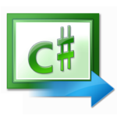


.. index::
   pair: C♯ ; Language
   ! C♯

.. _csharp_language:

=============
C♯ language
=============

.. seealso::

   - https://secure.wikimedia.org/wikipedia/en/wiki/C_Sharp_%28programming_language%29
   - https://secure.wikimedia.org/wikipedia/fr/wiki/C_sharp
   - :ref:`mono`

.. contents::
   :depth: 3

Introduction
=============

C♯ (pronounced /ˈsiː ˈʃɑrp/ see sharp) is a multi-paradigm programming
language encompassing imperative, declarative, functional, generic,
object-oriented (class-based), and component-oriented programming disciplines.

It was developed by Microsoft within the .NET initiative and later approved as a
standard by Ecma (ECMA-334) and ISO (ISO/IEC 23270). C♯  is one of the
programming languages designed for the Common Language Infrastructure.

C♯  is intended to be a simple, modern, general-purpose, object-oriented
programming language. Its development team is led by Anders Hejlsberg.

The most recent version is C# 5.0, which was released on August 15, 2012.

Le nom "C sharp" n'est pas la correspondance du logo C♯ . En effet, le caractère
"#" est appelé "number sign" en américain alors que "sharp" est le nom du
caractère "♯" utilisé en musique.

La normalisation du langage par l'ECMA indique bien ces deux aspects.
La même confusion est souvent faite en français entre les noms croisillon (#)
et dièse (♯).

De plus, "♯" correspond à la note de musique "Do", "C sharp" signifie donc
"Do dièse".

Microsoft précise cependant que le terme **sharp** choisi fait bien référence à
la notation musicale, et que ce n'est que par facilité d'écriture qu'en pratique
le symbole # est utilisé.

C♯ documentation
================

.. toctree::
   :maxdepth: 6

   bridges/index

C♯ documentation
================

.. toctree::
   :maxdepth: 6

   doc/index

C♯ versions
================

.. toctree::
   :maxdepth: 4

   versions/index

C♯ coding standards
====================

.. toctree::
   :maxdepth: 3

   coding_standards/index

C♯ links
================

.. toctree::
   :maxdepth: 4

   links/index

C♯ libraries
================

.. toctree::
   :maxdepth: 4

   libraries/index

C♯ modules
================

.. toctree::
   :maxdepth: 4

   modules/index

C♯ mono
========

.. toctree::
   :maxdepth: 4

   mono/index

C♯ people
==========

.. toctree::
   :maxdepth: 4

   people/index

C♯ books
========

.. toctree::
   :maxdepth: 4

   books/index

C♯ bindings
================

.. toctree::
   :maxdepth: 4

   bindings/index

