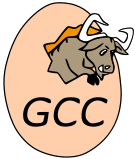


.. index::
   pair: Compilers; GNU Compiler Collection
   ! GCC

.. _gcc:

=============================
GCC (GNU Compiler Collection)
=============================

.. seealso::

   - http://gcc.gnu.org/
   - http://fr.wikipedia.org/wiki/GNU_Compiler_Collection

.. contents::
   :depth: 3

Introduction
============

GNU Compiler Collection, abrégé en GCC, est un ensemble de compilateurs créés
par le projet GNU. Les compilateurs sont des logiciels libres intégrés capables
de compiler divers langages de programmation, dont C, C++, Objective-C, Java,
Ada et Fortran.

GCC est utilisé pour le développement de la plupart des logiciels libres.
Le noyau Linux dépend notamment étroitement des fonctionnalités de GCC.

Présentation
============

GCC a été conçu pour remplacer le compilateur C fourni en standard sur le
système d'exploitation Unix, qui s'appelle CC. GCC signifiait à l'origine
GNU C Compiler, soit le **compilateur C de GNU**. Comme GCC est très extensible,
le support de nombreux autres langages a été ajouté et le nom officiel a été
changé en GNU Compiler Collection (note : sans **s** à Compiler).

En pratique, l'abréviation GCC est utilisée pour nommer trois entités légèrement différentes :

- la collection complète de compilateurs (le **projet GCC**) ;
- la partie commune à tous les compilateurs (**GCC**) ;
- le compilateur C lui-même (le frontend **gcc**, écrit en minuscule).

Pour faire référence précisément aux compilateurs de chaque langage, on parle de :

- gcc pour C ;
- G++ pour C++ ;
- GobjC pour Objective C
- GCJ pour Java ;
- GNAT pour Ada ;
- Gfortran pour Fortran ;
- GPC pour le Pascal;
- GHDL pour le VHDL.
- GDC pour le D

Plugins
========

.. toctree::
   :maxdepth: 3

   plugins/index

Versions
========

.. toctree::
   :maxdepth: 3

   versions/index

