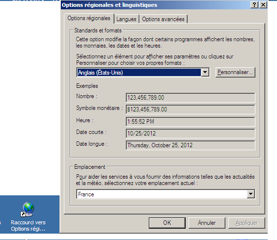

.. index::
   pair: Parsers ; C#
   pair: Convert ; C#

.. _csharp_convert_parser:

==================
C# convert parser
==================

.. seealso::

   - http://msdn.microsoft.com/fr-fr/library/bds4fye2%28v=vs.100%29.aspx
   - http://msdn.microsoft.com/fr-fr/library/system.convert%28v=vs.100%29.aspx

.. contents::
   :depth: 3

Introduction
============

Convertit un type de données de base en un autre type de données de base.

Parse a double
==============

.. seealso::

   - http://msdn.microsoft.com/fr-fr/library/system.convert.todouble%28v=vs.100%29.aspx

.ini file
---------

::

    [Acquisition]
    Format=JPG
    IntervalleInterPuits=3.0

Convert.ToDouble préciser la culture
++++++++++++++++++++++++++++++++++++
::

    CultureInfo culture_en = new CultureInfo("en-Gb");    // Pour la notation des doubles avec ".". Exemple: 1.5

    try
    {
        string intervalle_inter_puits = parser.GetSetting("Acquisition", "IntervalleInterPuits");
        IniFile.IntervalleInterPuits = Convert.ToDouble(intervalle_inter_puits, culture_en);
    }
    catch (Exception ex)
    {
         MessageBox.Show("Pb in Convert.ToDouble");
        throw new Exception("Acquisition/IntervalleInterPuits", ex);
    }

.. warning:: Il faut écrire aussi avec la culture anglaise.

string.Format : préciser la culture
+++++++++++++++++++++++++++++++++++

::

    CultureInfo culture_en = new CultureInfo("en-Gb");    // Pour la notation des doubles avec ".". Exemple: 1.5
    string value_double = string.Format(culture_en, "{0:0.0}", IniFile.IntervalleInterPuits);
    data = String.Format("IntervalleInterPuits={0}\n", value_double);

Fixer une langue pour être portable
+++++++++++++++++++++++++++++++++++

Si votre PC est initialisé avec une culture différente, il n'y aura pas de problème
de codage ou décodage.

   Locale en anglais

Sur cet exemple, la langue locale est en anglais mais si vous êtes en français,
le codage/décodage marchera et le fichier sera portable d'un ordinateur à
l'autre, ce qui n'est pas le cas **si on ne fixe pas une langue**.

Parse an Int32
==============

.ini file
---------

::

    [Exposition]
    Temps=200
    Gain=20

::

    IniFile.GainExposition = 0;
    try
    {
        //
        string gain = parser.GetSetting("Exposition", "Gain");

        IniFile.GainExposition = Convert.ToInt32(gain);
    }
    catch (Exception ex)
    {
        throw new Exception("Exposition/Gain", ex);
    }
