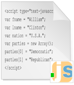



.. index::
   pair: Javascript ; Language
   ! Javascript

.. _javascript_language:

===================
javascript language
===================

.. seealso::

   - http://fr.wikipedia.org/wiki/Javascript
   - https://developer.mozilla.org/en-US/docs/Web/JavaScript

.. contents::
   :depth: 3

Introduction
============

JavaScript est un langage de programmation de scripts principalement utilisé
dans les pages web interactives mais aussi côté serveur.

C'est un langage orienté objet à prototype, c'est-à-dire que les bases du
langage et ses principales interfaces sont fournies par des objets qui ne sont
pas des instances de classes, mais qui sont chacun équipés de constructeurs
permettant de générer leurs propriétés, et notamment une propriété de
prototypage qui permet d'en générer des objets héritiers personnalisés.

Le langage a été créé en 1995 par Brendan Eich pour le compte de Netscape
Communications Corporation.

Le langage, actuellement à la version 1.8.2 est une implémentation de la 3e
version de la norme ECMA-262 qui intègre également des éléments inspirés du
langage Python.

La version 1.8.5 du langage est prévue pour intégrer la 5e version du
standard ECMA2.

Infos Javascript
=================

.. toctree::
   :maxdepth: 4

   applis_on_desktop/index
   books/books
   engines/index
   frameworks/frameworks
   pre_compilers/index
   history_brendan
   libraries/libraries
   multithreading
   news
   nodejs/index
   people/index
   tools/index
   tutorials/tutorials

