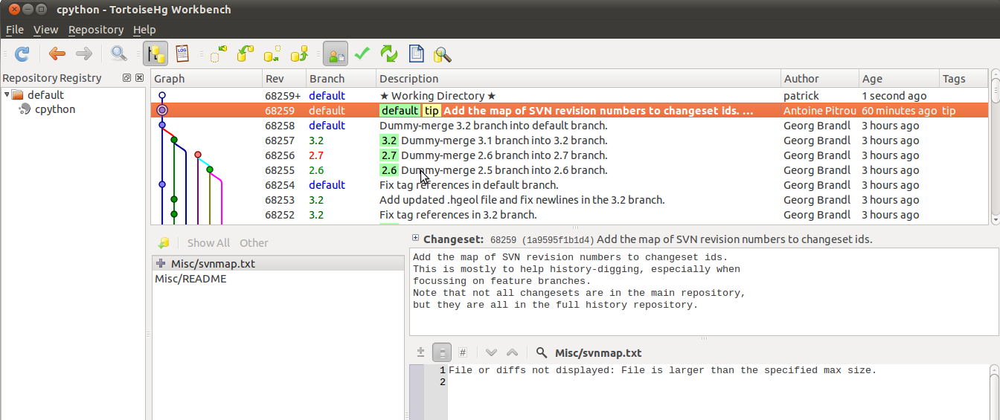



.. index::
   5 march 2011

====================================================
CPython hg transition complete, march march 2011
====================================================

::

	-------- Message original --------
	Sujet: 	[Python-Dev] CPython hg transition complete
	Date : 	Sat, 05 Mar 2011 18:39:52 +0100
	De : 	Georg Brandl <g.brandl@gmx.net>
	Pour : 	python-dev@python.org

I'm very happy to announce that the core Python repository switch
to Mercurial is complete and the new repository at
http://hg.python.org/cpython/ is now officially open for cloning,
and for commits by those who had commit access to SVN.

The developers' guide at http://docs.python.org/devguide/ has
been updated to talk about Mercurial and should be enough to
get anyone started with a clone.

We'll work on extracting active feature branches into separate
clones next; please let us know which branches these are (we
already know of py3k-cdecimal, pep-3151 and pep-382).

To make new feature "branches" (ie. clones) that are to be
available at hg.python.org, best use the "server side clone"
feature that is available at http://hg.python.org/cpython/
in order to create the new repository.

To look up SVN revisions, use hg.python.org/lookup/rXXXXX.
The tracker has also been updated to link to hg.python.org
for files and revisions.  For the future, it will recognize
hg changeset hashes as well (without brackets, see the recent
thread).

The buildbots should also now be building from the hg repositories.

Please let me know if you notice any disruptions, or anything
else that needs fixing, or any other question.  

Also please redirect praise to Antoine Pitrou and Dirkjan Ochtman who did
most of the actual work.

Georg

