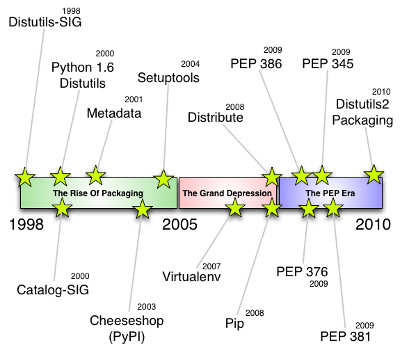



.. index::
   pair: History; Packaging
   pair: Packaging; PEP 0386

.. _python_install_history:

============================
python installation history
============================

.. seealso::

   - http://blog.ziade.org/2012/11/17/chronology-of-packaging/

.. contents::
   :depth: 3

Python installation history 2010-2012
======================================

.. seealso::

   - https://crate.io/
   - :ref:`wheel`

- 2012: Crate.io is launched
- 2012: The :ref:`wheel binary format <wheel>` is proposed
- 2012: Distlib, a subset of Distutils2. Is launched.
- 2012: pypi-mirrors.org is launched
- 2012: Packaging is removed from the stdlib, considered not matured yet. :(
- 2011: Distutils2 is added in the stdlib, under the packaging name.
- 2011: I am retiring from the packaging work :)

Python installation history 1998-2010
======================================

.. seealso::

   - http://www.python.org/dev/peps/pep-0386/

- 1998: Distutils-SIG created
- 2000: Python 1.6 with Distutils included in the stdlib
- 2000: Catalog-SIG created
- 2001: First version of the Metadata
- 2003: The Cheeseshop (poorly named PyPI, eventually)
- 2004: The Setuptools project gets a lot of traction
- 2006: The zc.buildout project is launched to deploy Zope apps
- 2007: The Virtualenv project is started
- 2008: The pip project is started
- 2008: The Distribute project (Setuptools fork) is launched.
- 2009: PEP 345, 376, 386 and 381 are accepted.
- 2010: The Distutils2 project that implements all PEPs is started.
  It's based on Distutils.

Wheel History
=============

.. seealso::

   - http://wheel.readthedocs.org/en/latest/story.html
   - :ref:`wheel`

