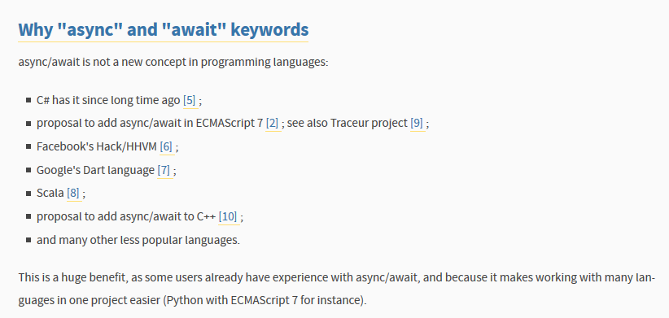


.. index::
   pair: PEP; 0492
   pair: Python; Coroutines
   pair: Python; async and await

.. _python_pep_0492:

============================================================================
pep 0492 Coroutines with async and await syntax
============================================================================

.. seealso::

   - http://www.python.org/dev/peps/pep-0492/
   - https://twitter.com/1st1 (Yury Selivanov)

.. contents::
   :depth: 3

Abstract
=========

Why "async" and "await" keywords
=================================

async/await is not a new concept in programming languages:

- C# has it since long time ago [5] ;
- proposal to add async/await in ECMAScript 7 [2] ; see also Traceur project [9] ;
- Facebook's Hack/HHVM [6] ;
- Google's Dart language [7] ;
- Scala [8] ;
- proposal to add async/await to C++ [10] ;
- and many other less popular languages.

This is a huge benefit, as some users already have experience with async/await, 
and because it makes working with many languages in one project easier 
(Python with ECMAScript 7 for instance).

