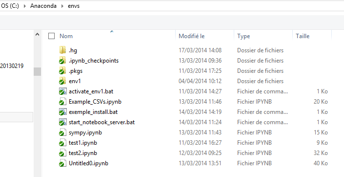
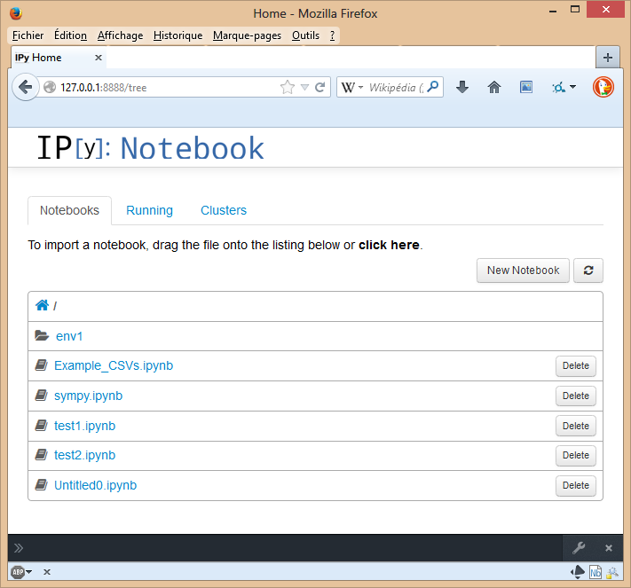


.. index::
   pair: Anaconda; Notebook

.. _howto_use_ipython_notebook_ana:

==========================================
How to use IPython Notebook with anaconda
==========================================

.. seealso::

   - https://github.com/ipython/ipython/tree/master/examples/notebooks

.. contents::
   :depth: 3
      
   
Overview
========

   

activate_env1.bat
=================

.. literalinclude:: activate_env1.bat
   

start_notebook_server.bat
==========================

.. literalinclude:: start_notebook_server.bat
   
   
::

    [env1] C:\Anaconda\envs>ipython notebook --matplotlib inline 2014-04-04 15:16:05.365 [NotebookApp] Using existing profile dir: u'Z:\\
    .ipython\\profile_default'
    2014-04-04 15:16:05.576 [NotebookApp] Using MathJax from CDN: http://cdn.mathjax.org/mathjax/latest/MathJax.js
    2014-04-04 15:16:05.933 [NotebookApp] Serving notebooks from local directory: C:\Anaconda\envs
    2014-04-04 15:16:05.934 [NotebookApp] 0 active kernels
    2014-04-04 15:16:05.934 [NotebookApp] The IPython Notebook is running at: http://127.0.0.1:8888/
    2014-04-04 15:16:05.934 [NotebookApp] Use Control-C to stop this server and shut down all kernels (twice to skip confirmation).
    INFO:tornado.access:302 GET /tree/ (127.0.0.1) 1.00ms
    INFO:tornado.access:302 GET /tree/ (127.0.0.1) 0.00ms
    2014-04-04 15:16:50.157 [NotebookApp] WARNING | Notebook /sympy.ipynb is not trusted
    2014-04-04 15:16:50.719 [NotebookApp] Kernel started: d395ad29-f4fb-45d5-a3c1-76b9ee53a3ff
    2014-04-04 15:17:39.737 [NotebookApp] Saving notebook at /sympy.ipynb   

Le serveur
===========

   
   
