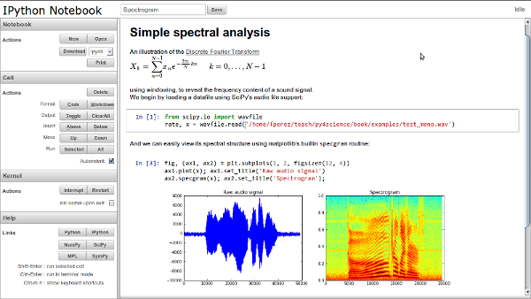
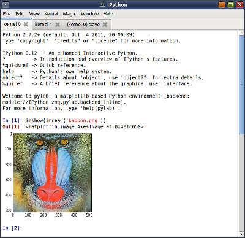


.. index::
   pair: zeroMQ; IPython

.. _ipython_version_0.1.2:

=============================
IPython 0.1.2 (december 2011)
=============================

.. seealso::

   - http://ipython.org/ipython-doc/rel-0.12/whatsnew/version0.12.html

.. contents::
   :depth: 3

Announce
========

We’re pleased to announce the release of IPython 0.12, a major new version.

The highlight of this release is the IPython Notebook, an interactive Python
interface running in the browser.

Download it now, or read more about what’s new.

IPython 0.12 contains several major new features, as well as a large amount of
bug and regression fixes.  The 0.11 release brought with it a lot of new
functionality and major refactorings of the codebase; by and large this has
proven to be a success as the number of contributions to the project has
increased dramatically, proving that the code is now much more approachable.
But in the refactoring inevitably some bugs were introduced, and we have also
squashed many of those as well as recovered some functionality that had been
temporarily disabled due to the API changes.

The following major new features appear in this version.

An interactive browser-based Notebook with rich media support
==============================================================

A powerful new interface puts IPython in your browser. You can start it with
the command ``ipython notebook``:

    The new IPython notebook showing text, mathematical expressions in LaTeX,
    code, results and embedded figures created with Matplotlib.

This new interface maintains all the features of IPython you are used to, as it
is a new client that communicates with the same IPython kernels used by the
terminal and Qt console.  But the web notebook provides for a different
workflow where you can integrate, along with code execution, also text,
mathematical expressions, graphics, video, and virtually any content that a
modern browser is capable of displaying.

You can save your work sessions as documents that retain all these elements and
which can be version controlled, emailed to colleagues or saved as HTML or PDF
files for printing or publishing statically on the web.  The internal storage
format is a JSON file that can be easily manipulated for manual exporting to
other formats.

This Notebook is a major milestone for IPython, as for years we have tried to
build this kind of system.  We were inspired originally by the excellent
implementation in Mathematica, we made a number of attempts using older
technologies in earlier Summer of Code projects in 2005 (both students and
Robert Kern developed early prototypes), and in recent years we have seen the
excellent implementation offered by the `Sage <http://sagemath.org>` system.

But we continued to work on something that would be consistent with the rest of
IPython's design, and it is clear now that the effort was worth it: **based on
the ZeroMQ communications architecture** introduced in version 0.11, the notebook
can now retain 100% of the features of the real IPython.

But it can also provide **the rich media support and high quality Javascript
libraries** that were not available in browsers even one or two years ago
(such as high-quality mathematical rendering or built-in video).

The notebook has too many useful and important features to describe in these
release notes; our documentation now contains a directory called
``examples/notebooks`` with several notebooks that illustrate various aspects
of the system.  You should start by reading those named
``00_notebook_tour.ipynb`` and ``01_notebook_introduction.ipynb`` first, and
then can proceed to read the others in any order you want.

To start the notebook server, go to a directory containing the notebooks you
want to open (or where you want to create new ones) and type::

  ipython notebook

You can see all the relevant options with::

  ipython notebook --help
  ipython notebook --help-all  # even more

and just like the Qt console, you can start the notebook server with pylab
support by using::

  ipython notebook --pylab

for floating matplotlib windows or::

  ipython notebook --pylab inline

for plotting support with automatically inlined figures.  Note that it is now
possible also to activate pylab support at runtime via ``%pylab``, so you do
not need to make this decision when starting the server.

Two-process terminal console
=============================

Based on the same architecture as the notebook and the Qt console, we also have
now a terminal-based console that can connect to an external IPython kernel
(the same kernels used by the Qt console or the notebook, in fact).  While this
client behaves almost identically to the usual IPython terminal application,
this capability can be very useful to attach an interactive console to an
existing kernel that was started externally.  It lets you use the interactive
``%debug`` facilities in a notebook, for example (the web browser can't
interact directly with the debugger) or debug a third-party code where you may
have embedded an IPython kernel.

This is also something that we have wanted for a long time, and which is a
culmination (as a team effort) of the work started last year during the 2010
Google Summer of Code project.

Tabbed QtConsole
=================

The QtConsole now supports starting multiple kernels in tabs, and has a
menubar, so it looks and behaves more like a real application.  Keyboard
enthusiasts can disable the menubar with ctrl-shift-M .

    The improved Qt console for IPython, now with tabs to control multiple
    kernels and full menu support.

Full Python 3 compatibility
============================

IPython can now be installed from a single codebase on Python 2 and
Python 3. The installation process for Python 3 automatically runs 2to3. The
same 'default' profile is now used for Python 2 and 3 (the previous version had
a separate 'python3' profile).

Standalone Kernel
==================

The ``ipython kernel`` subcommand has been added, to allow starting a
standalone kernel, that can be used with various frontends.  You can then later
connect a Qt console or a terminal console to this kernel by typing e.g.::

  ipython qtconsole --existing

if it's the only one running, or by passing explicitly the connection
parameters (printed by the kernel at startup).

PyPy support
=============

The terminal interface to IPython now runs under `PyPy <http://pypy.org/>`_.
We will continue to monitor PyPy's progress, and hopefully before long at least
we'll be able to also run the notebook.  The Qt console may take longer, as Qt
is a very complex set of bindings to a huge C++ library, and that is currently
the area where PyPy still lags most behind.  But for everyday interactive use
at the terminal, with this release and PyPy 1.7, things seem to work quite well
from our admittedly limited testing.

Other important new features
=============================

* **SSH Tunnels**: In 0.11, the :mod:`IPython.parallel` Client could tunnel its
  connections to the Controller via ssh. Now, the QtConsole ssh tunneling, as do
  parallel engines.

* **relaxed command-line parsing**: 0.11 was released with overly-strict
  command-line parsing, preventing the ability to specify arguments with spaces,
  e.g. ``ipython --pylab qt`` or ``ipython -c "print 'hi'"``. This has
  been fixed, by using argparse. The new parsing is a strict superset of 0.11, so
  any commands in 0.11 should still work in 0.12.

* **HistoryAccessor**: The :class:`~IPython.core.history.HistoryManager` class
  for interacting with your IPython SQLite history database has been split,
  adding a parent :class:`~IPython.core.history.HistoryAccessor` class, so that
  users can write code to access and search their IPython history without being
  in an IPython session.

* **kernel %gui and %pylab**: The ``%gui`` and ``%pylab`` magics have been
  restored to the IPython kernel (e.g. in the qtconsole or notebook). This
  allows activation of pylab-mode, or eventloop integration after starting the
  kernel, which was unavailable in 0.11.  Unlike in the terminal, this can be
  set only once, and cannot be changed.

* **%config**: A new ``%config`` magic has been added, giving easy access to the
  IPython configuration system at runtime.

* **Multiline History**: Multiline readline history has been restored to the
  Terminal frontend by default.

* **%store**: The ``%store`` magic from earlier versions has been updated and
  re-enabled. To autorestore
  stored variables on startup, specify ``c.StoreMagic.autorestore = True`` in
  :file:`ipython_config.py`.

