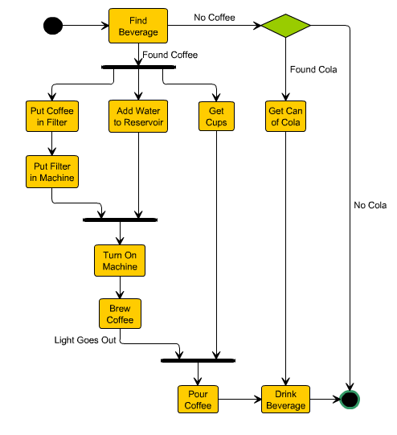
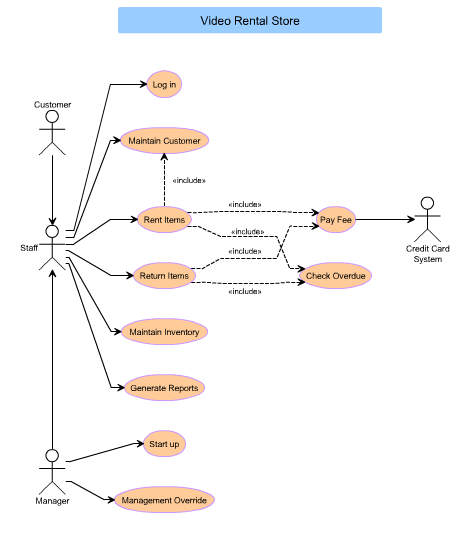



.. index::
   pair: Diagram; UML
   pair: Uses cases; UML
   pair: State ; UML

.. _yed_uml_diagrams:

===================
yEd UML diagrams
===================

.. seealso:: 

   - http://www.yworks.com/en/products_yfiles_practicalinfo_gallery.html

.. contents::
   :depth: 3
   
   
Introduction
=============

Creating UML diagrams automatically is not an easy task. 

Some of the many existing UML tools do not deliver impressive automatic 
layout support.

yFiles on the other hand is able to provide excellent layout engines for 
UML diagrams. Below are some UML diagrams that are produced by 
yFiles-powered programs. 

State diagrams
==============

   

Use cases
=========

