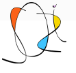



.. index::
   pair: Inkscape ; Sozi
   pair: Presentation ; Sozi

.. _inkscape_sozi_extension:

========================================
Inkscape sozi extension (Presentation)
========================================

.. seealso::

   - http://sozi.baierouge.fr/wiki/sozi
   - http://senshu.baierouge.fr/
   - https://identi.ca/senshu
   - https://twitter.com/#!/senshuapash
   - :ref:`presentation_sozi`
   - https://fr.wikipedia.org/wiki/Sozi

Description
============

Sozi est un petit programme qui permet de jouer des présentations animées.

Contrairement aux outils de présentation classiques, un document Sozi n'est
pas organisé comme un diaporama.

Il s'agit plutôt d'un poster où la disposition  du contenu est entièrement libre.
Le déroulement de la présentation consiste  en une succession de translations,
zooms et rotations permettant de focaliser l'attention sur les éléments que
vous voulez montrer.

Sozi repose sur des standards ouverts. C'est un logiciel libre sous licence
GPL 3.0.

Créer
=====

Une présentation Sozi est un document au format SVG dans lequel une séquence
de “vues” a été définie. Ces vues sont délimitées par des rectangles auxquels
sont associées des informations sur la présentation et l'animation, comme par
exemple la durée des transitions.

L'éditeur de présentations est une extension pour le logiciel de dessin
vectoriel :ref:`Inkscape <inkscape>`. Il est ainsi possible de construire
l'intégralité d'une présentation en restant dans le même environnement.

- `Installer Sozi`_.

.. _`Installer Sozi`: http://sozi.baierouge.fr/wiki/fr:installer

Contribuer
===========

Le dépôt officiel du code source, chez GitHub_.
Signaler_ un problème ou proposer une fonctionnalité.

.. _GitHub: https://github.com/senshu/Sozi
.. _Signaler: http://github.com/senshu/Sozi/issues

Documentation pour les développeurs
===================================

Installer Sozi à partir des fichiers sources_.
Les éléments et attributs XML_ spécifiques à Sozi.
Liste des contributeurs.

.. _sources: http://sozi.baierouge.fr/wiki/fr:sources
.. _XML: http://sozi.baierouge.fr/wiki/fr:format
.. _contributeurs: http://sozi.baierouge.fr/wiki/fr:contributeurs

Presentations
=============

.. seealso:: http://sozi.wikidot.com/presentations

Voir Aussi sozigen
==================

.. seealso:: https://pypi.python.org/pypi/sozigen/0.1.0

This project's purpose is to automate buildoing of the hierachical slideshows.
It is useful to show monitoring graphs on large TV displays and projectors.

With SoziGen, you describe graphs layout in python and it generates SVG file
to be opened in any modern web browser.

