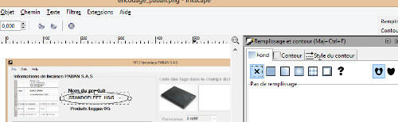



.. index::
   pair: Inkscape ; Tips

.. _inkscape_tips:

====================
Inkscape tips
====================

.. contents::
   :depth: 3

Poser une forme et faire qu'elle soit transparente
==================================================

- faire un clique droit sur la forme
- choisir "Fill and Stroke" (Remplissage et contour)
- cliquer sur la croix (No paint)

Comment tracer une droite
==========================

.. toctree::
   :maxdepth: 3
   
   tracer_droite/index
   
   
   
   
   
