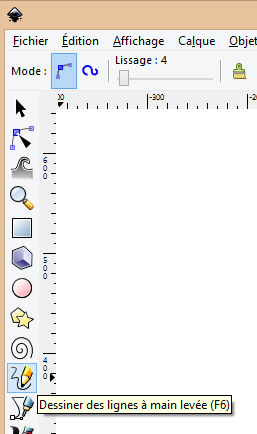



.. index::
   pair: Inkscape ; Droite

==========================
Comment tracer une droite
==========================

.. seealso::

   - http://forum.ubuntu-fr.org/viewtopic.php?id=199796
   
   

      
   
::

    en résumé, tu fais un premier clic "court" pour faire le premier point, un 
    second clic "court" plus loin pour faire un second point, puis tu appuies sur 
    entrée. et voila.   
    
    
   
